```python
import os 
#if you want to know current working dir
os.getcwd()
#if you want to change
os.chdir('/Users/xinyuhuangmac/Google Drive/M1S2/rp/wordle')
```

# Introduction
 Dans ce projet, on s'intéresse à modéliser le jeu wordle mind en appliquant les méthodes de satisfaction de contraintes et un algorithme génétique

# CSP
- a1
- a2
- algo probabiliste
- algo triche


```python
from constraint import *
import numpy as np
from copy import deepcopy

def readfile(file):
    lines=[]
    dic_file=dict()
    with open(file) as f:
        for line in f:
            word=[i for i in line.rstrip()]
            lg_word=len(word)
            if lg_word in dic_file:
                dic_file[lg_word].append(word)
            else:
                dic_file[lg_word]=[word]
    return dic_file


def check_correct(instance, word):
    bien_place=0
    mal_place=0
    list_not_match1=[]
    list_not_match2=[]
    for i in range(len(instance)):
        if instance[i]==word[i]:
            bien_place+=1
        else:
            list_not_match1.append(instance[i])
            list_not_match2.append(word[i])
    for letter in list_not_match1:
        if letter in list_not_match2:
            list_not_match2.remove(letter)
            mal_place+=1
    return bien_place, mal_place


def solver_a1(word, list_mot, list_domain,render=0):
    n=len(word)
    pb=Problem()


    for i in range(n):
        name_variable=str(i)
        pb.addVariables(name_variable,list_domain[i])

    solutions=deepcopy(list_mot)
    bien_place=1
    index=np.random.randint(solutions.shape[0])
    solution=solutions[index]
    bien_place, mal_place = check_correct(solution, word )
    solutions=np.array([ solutions[i] for i in range(solutions.shape[0] ) if i!=index])
    counter=1
    true_count=0
    if render==0:
        print("Word to guess: ",word)
        print(counter, solution, word, bien_place, mal_place )
    while bien_place<n:
        counter+=1
        if bien_place==0:
            for i in range(n):
                if solution[i] in pb._variables[str(i)]:
                    pb._variables[str(i)].remove(solution[i])
                    solutions=solutions[np.where(solutions[:,i]!=solution[i])]

        index=np.random.randint(len(solutions))
        solution=solutions[index]
        solutions=np.array([solutions[i] for i in range(len(solutions) ) if i!=index])
        bien_place, mal_place = check_correct(solution, word)
        if render==0:
            print(counter, solution, word, bien_place, mal_place )
    return counter

def solver_a2(word, list_mot, list_domain,render=0):
    n=len(word)
    pb=Problem()

    for i in range(n):
        name_variable=str(i)
        pb.addVariables(name_variable,list_domain[i])

    solutions=deepcopy(list_mot)
    bien_place=1
    index=np.random.randint(solutions.shape[0])
    solution=solutions[index]

    bien_place, mal_place = check_correct(solution, word )
    solutions=np.array([ solutions[i] for i in range(solutions.shape[0] ) if i!=index])
    counter=1
    if render==0:
        print("Word to guess: ",word)
        print(counter, solution, word, bien_place, mal_place )
    while bien_place<n:
        counter+=1
        if bien_place==0:
            if mal_place==0:
                for i in range(n):
                    for j in range(n):
                        if solution[i] in pb._variables[str(j)]:
                            pb._variables[str(j)].remove(solution[i])
                            solutions=solutions[np.where(solutions[:,j]!=solution[i])]
            else:
                for i in range(n):
                    if solution[i] in pb._variables[str(i)]:
                        pb._variables[str(i)].remove(solution[i])
                        solutions=solutions[np.where(solutions[:,i]!=solution[i])]

        index=np.random.randint(len(solutions))
        solution=solutions[index]
        solutions=np.array([solutions[i] for i in range(len(solutions) ) if i!=index])
        bien_place, mal_place = check_correct(solution, word)
        if render==0:
            print(counter, solution, word, bien_place, mal_place )

    return counter


def generate_probabiliste_dict(list_mot, n):
    nb_dict=dict()
    pb_dict=dict()
    total=len(list_mot)
    for i in range(n):
        nb_dict[i]=dict()
    for mot in list_mot:
        for i in range(n):
            letter=mot[i]
            if letter in nb_dict[i]:
                nb=nb_dict[i][letter]
                nb_dict[i][letter]=nb+1
            else:
                nb_dict[i][letter]=1
    for index, mot in enumerate(list_mot):
        #print( np.log(np.prod([ nb_dict[i][mot[i]]/total for i in range(n)])))
        #print()
        pb_dict[index]=np.sum([ np.log(nb_dict[i][mot[i]]/total) for i in range(n)])
    return pb_dict


def solver_csp_probabiliste(word, list_mot, list_domain, render=0):
    n=len(word)
    pb=Problem()


    for i in range(n):
        name_variable=str(i)
        pb.addVariables(name_variable,list_domain[i])

    solutions=deepcopy(list_mot)
    bien_place=1

    pb_dict=generate_probabiliste_dict(list_mot, n)
    index=max(pb_dict, key=pb_dict.get)
    solution=solutions[index]

    bien_place, mal_place = check_correct(solution, word )
    solutions=np.array([ solutions[i] for i in range(solutions.shape[0] ) if i!=index])
    counter=1
    if render==0:
        print("Word to guess: ",word)
        print(counter, solution, word, bien_place, mal_place )
    while bien_place<n:
        counter+=1
        change=0
        if bien_place==0:
            change=1
            if mal_place==0:
                for i in range(n):
                    for j in range(n):
                        if solution[i] in pb._variables[str(j)]:
                            pb._variables[str(j)].remove(solution[i])
                            solutions=solutions[np.where(solutions[:,j]!=solution[i])]
            else:
                for i in range(n):
                    if solution[i] in pb._variables[str(i)]:
                        pb._variables[str(i)].remove(solution[i])
                        solutions=solutions[np.where(solutions[:,i]!=solution[i])]
        if change==1:
            pb_dict=generate_probabiliste_dict(solutions, n)
            index=max(pb_dict, key=pb_dict.get)
        else:
            index=np.random.randint(len(solutions))
        solution=solutions[index]
        solutions=np.array([solutions[i] for i in range(len(solutions) ) if i!=index])
        bien_place, mal_place = check_correct(solution, word)
        if render==0:
            print(counter, solution, word, bien_place, mal_place )
    return counter

def solver_triche(word, list_mot, list_domain, render=0):
    def find_bien_place(solution, n, count_bien, list_index, word):
        counter=0
        for i in range(n):
            if i not in list_index:
                avant=solution[i]
                solution[i]="_"
                bien_place_new,_ =check_correct(solution, word)
                counter+=1
                if bien_place_new<count_bien:

                    solution[i]=avant
                    return i,counter
        print("Erreur : func_find_bien_place")

    def correct_mal_place(solution, n, count_bien, count_mal, list_index, word):
        counter=0
        for i in range(n):
            if i not in list_index:
                for j in range(n):
                    if j not in list_index:
                        temp=solution[j]
                        solution[j]=solution[i]
                        counter+=1
                        bien_place_new, mal_place_new =check_correct(solution, word)
                        if bien_place_new>count_bien :#and <count_mal:
                            #count_mal=mal_place_new
                            #print(solution, word,i,j)
                            #print(temp,j, "here")
                            return j,bien_place_new,mal_place_new,counter
                        solution[j]=temp
    n=len(word)
    pb=Problem()
    solutions=deepcopy(list_mot)
    for i in range(n):
        name_variable=str(i)
        pb.addVariables(name_variable,list_domain)

    index=np.random.randint(len(solutions))
    solution=solutions[index]
    solutions=np.array([ solutions[i] for i in range(solutions.shape[0] ) if i!=index])
    counter=1
    bien_fix=0
    list_index=[]

    bien_place=0
    while bien_place<n:

        bien_place, mal_place = check_correct(solution, word)
        if bien_place==0:
            if mal_place==0:
                for i in range(n):
                    for j in range(n):
                        if solution[i] in pb._variables[str(j)]:
                            pb._variables[str(j)].remove(solution[i])
                            solutions=solutions[np.where(solutions[:,j]!=solution[i])]
            else:
                for i in range(n):
                    if solution[i] in pb._variables[str(i)]:
                        pb._variables[str(i)].remove(solution[i])
                        solutions=solutions[np.where(solutions[:,i]!=solution[i])]
        if bien_place==n:
            if render==0:
                print(counter, solution, word, bien_place, mal_place )
            break

        while bien_place>bien_fix:
            ind,count=find_bien_place(solution, n, bien_place, list_index, word)
            list_index.append(ind)
            solutions=solutions[np.where(solutions[:,ind]==solution[ind])]
            counter+=count
            bien_fix+=1
        bien_place, mal_place = check_correct(solution, word)
        if bien_place==n:
            if render==0:
                print(counter, solution, word, bien_place, mal_place )
            break
        while mal_place>0:
            j,bien_place,mal_place_new,count=correct_mal_place(solution, n, bien_place, mal_place,list_index, word)
            list_index.append(j)
            bien_fix+=1
            solutions=solutions[np.where(solutions[:,j]==solution[j])]
            counter+=count
            mal_place=mal_place_new
        index=np.random.randint(len(solutions))
        solution=solutions[index]
        solutions=np.array([ solutions[i] for i in range(solutions.shape[0] ) if i!=index])
        bien_place, mal_place = check_correct(solution, word)
        counter+=1
        if render==0:
            print(counter, solution, word, bien_place, mal_place )
    return counter
```


```python
dictionnary=readfile('./dico.txt')
import time
import matplotlib.pyplot as plt
```


```python
list_t1,list_t2=[],[]
list_iter1,list_iter2=[],[]
for n in range(2,10):
    list_mot=np.array(dictionnary[n])
    list_domain=[list(set(np.array(list_mot)[:,i] )) for i in range(n) ]
    sl_iter1,sl_iter2=[],[]
    sl_t1, sl_t2=[],[]
    print("n = ",n)
    for i in range(50):
        
        word=list_mot[np.random.randint(list_mot.shape[0])]
        start = time.time()
        sl_iter1.append(solver_a1(word,list_mot,list_domain,render=1))
        stop = time.time()
        sl_t1.append(stop-start)
                        
        start = time.time()
        sl_iter2.append(solver_a2(word,list_mot,list_domain,render=1))
        stop = time.time()
        sl_t2.append(stop-start)
        #print("============Word ",i+1,"Found===============")
    list_iter1.append(np.mean(sl_iter1))
    list_iter2.append(np.mean(sl_iter2))
    list_t1.append(np.mean(sl_t1))
    list_t2.append(np.mean(sl_t2))
```

    n =  2
    n =  3
    n =  4
    n =  5
    n =  6
    n =  7
    n =  8
    n =  9


## Comparer a1 et a2


```python
n_range=[i for i in range(2,(9+1))]
plt.plot(n_range,list_iter1, label="a1")
plt.plot(n_range,list_iter2, label="a2")
plt.title("L'évolution size-iterations")
plt.xlabel("size")
plt.ylabel("iterations")
plt.legend()
plt.show()
```


    
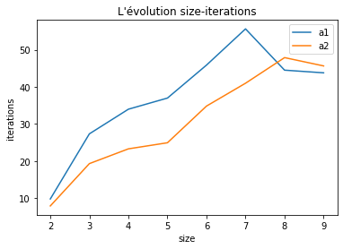
    


```python
n_range=[i for i in range(2,(9+1))]
plt.plot(n_range,list_t1, label="a1")
plt.plot(n_range,list_t2, label="a2")
plt.title("L'évolution size-time")
plt.xlabel("size")
plt.ylabel("time")
plt.legend()
plt.show()
```


    
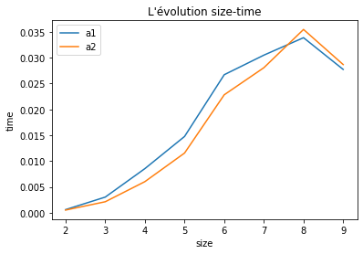
    


```python
list_t1,list_t2=[],[]
list_iter1,list_iter2=[],[]
nb_word=np.min([len(dictionnary[n]) for n in range(4,10)])
for n in range(4,10):
    di=deepcopy(dictionnary[n])
    np.random.shuffle(di)
    list_mot=np.array(di[:nb_word])
    list_domain=[list(set(np.array(list_mot)[:,i] )) for i in range(n) ]
    sl_iter1,sl_iter2=[],[]
    sl_t1, sl_t2=[],[]
    print("n = ",n)
    for i in range(200):
        
        word=list_mot[np.random.randint(list_mot.shape[0])]
        start = time.time()
        sl_iter1.append(solver_a1(word,list_mot,list_domain,render=1))
        stop = time.time()
        sl_t1.append(stop-start)
                        
        start = time.time()
        sl_iter2.append(solver_a2(word,list_mot,list_domain,render=1))
        stop = time.time()
        sl_t2.append(stop-start)
        #print("============Word ",i+1,"Found===============")
    list_iter1.append(np.mean(sl_iter1))
    list_iter2.append(np.mean(sl_iter2))
    list_t1.append(np.mean(sl_t1))
    list_t2.append(np.mean(sl_t2))
```

    n =  4
    n =  5
    n =  6
    n =  7
    n =  8
    n =  9


## Comparer a1 et a2 avec nombre de mots égaux


```python
n_range=[i for i in range(4,(9+1))]
plt.plot(n_range,list_iter1, label="a1")
plt.plot(n_range,list_iter2, label="a2")
plt.title("L'évolution size-iterations avec nombre de mots égaux")
plt.xlabel("size")
plt.ylabel("iterations")
plt.legend()
plt.show()
```


    
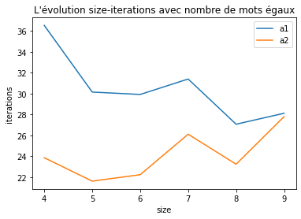
    


```python
n_range=[i for i in range(4,(9+1))]
plt.plot(n_range,list_t1, label="a1")
plt.plot(n_range,list_t2, label="a2")
plt.title("L'évolution size-time avec nombre de mots égaux")
plt.xlabel("size")
plt.ylabel("time")
plt.legend()
plt.show()
```


    
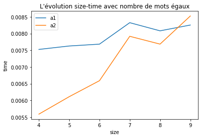
    


```python
list_t1,list_t2,list_t3=[],[],[]
list_iter1,list_iter2,list_iter3=[],[],[]
for n in range(2,10):
    list_mot=np.array(dictionnary[n])
    list_domain=[list(set(np.array(list_mot)[:,i] )) for i in range(n) ]
    sl_iter1,sl_iter2,sl_iter3=[],[],[]
    sl_t1, sl_t2,sl_t3=[],[],[]
    print("n = ",n)
    for i in range(100):
        
        word=list_mot[np.random.randint(list_mot.shape[0])]
        start = time.time()
        sl_iter1.append(solver_a1(word,list_mot,list_domain,render=1))
        stop = time.time()
        sl_t1.append(stop-start)
                        
        start = time.time()
        sl_iter2.append(solver_a2(word,list_mot,list_domain,render=1))
        stop = time.time()
        sl_t2.append(stop-start)
        start = time.time()
        sl_iter3.append(solver_csp_probabiliste(word,list_mot,list_domain,render=1))
        stop = time.time()
        sl_t3.append(stop-start)
        #print("============Word ",i+1,"Found===============")
    list_iter1.append(np.mean(sl_iter1))
    list_iter2.append(np.mean(sl_iter2))
    list_iter3.append(np.mean(sl_iter3))
    list_t1.append(np.mean(sl_t1))
    list_t2.append(np.mean(sl_t2))
    list_t3.append(np.mean(sl_t3))
```

    n =  2
    n =  3
    n =  4
    n =  5
    n =  6
    n =  7
    n =  8
    n =  9


## Comparer a1 a2  et algo probabiliste


```python
n_range=[i for i in range(2,(10))]
plt.plot(n_range,list_iter1, label="a1")
plt.plot(n_range,list_iter2, label="a2")
plt.plot(n_range,list_iter3, label="a3")
plt.legend()
plt.show()
```


    
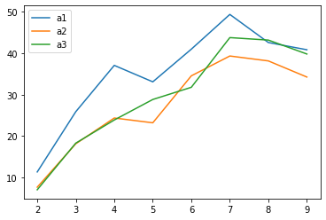
    


```python
n_range=[i for i in range(2,(10))]
plt.plot(n_range,list_t1, label="a1")
plt.plot(n_range,list_t2, label="a2")
plt.plot(n_range,list_t3, label="a3")
plt.legend()
plt.show()
```


    
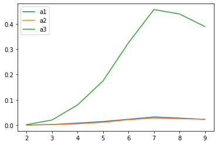
    


```python
list_t1,list_t2,list_t3,list_t4=[],[],[],[]
list_iter1,list_iter2,list_iter3,list_iter4=[],[],[],[]
for n in range(2,10):
    list_mot=np.array(dictionnary[n])
    list_domain=[list(set(np.array(list_mot)[:,i] )) for i in range(n) ]
    sl_iter1,sl_iter2,sl_iter3,sl_iter4=[],[],[],[]
    sl_t1, sl_t2,sl_t3,sl_t4=[],[],[],[]
    print("n = ",n)
    for i in range(100):
        
        word=list_mot[np.random.randint(list_mot.shape[0])]
        start = time.time()
        sl_iter1.append(solver_a1(word,list_mot,list_domain,render=1))
        stop = time.time()
        sl_t1.append(stop-start)
                        
        start = time.time()
        sl_iter2.append(solver_a2(word,list_mot,list_domain,render=1))
        stop = time.time()
        sl_t2.append(stop-start)
        start = time.time()
        sl_iter3.append(solver_csp_probabiliste(word,list_mot,list_domain,render=1))
        stop = time.time()
        sl_t3.append(stop-start)
        start = time.time()
        sl_iter4.append(solver_triche(word,list_mot,list_domain,render=1))
        stop = time.time()
        sl_t4.append(stop-start)
        #print("============Word ",i+1,"Found===============")
    list_iter1.append(np.mean(sl_iter1))
    list_iter2.append(np.mean(sl_iter2))
    list_iter3.append(np.mean(sl_iter3))
    list_iter4.append(np.mean(sl_iter4))
    list_t1.append(np.mean(sl_t1))
    list_t2.append(np.mean(sl_t2))
    list_t3.append(np.mean(sl_t3))
    list_t4.append(np.mean(sl_t4))
```

    n =  2
    n =  3
    n =  4
    n =  5
    n =  6
    n =  7
    n =  8
    n =  9


## Comparer a1 a2 algo probabiliste et algo triche


```python
n_range=[i for i in range(2,(10))]
plt.plot(n_range,list_iter1, label="a1")
plt.plot(n_range,list_iter2, label="a2")
plt.plot(n_range,list_iter3, label="algo_probabiliste")
plt.plot(n_range,list_iter4, label="algo_triche")
plt.title("L'évolution size-iterations ")
plt.xlabel("size")
plt.ylabel("iteration")
plt.legend()
plt.show()
```


    
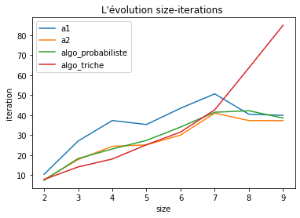
    


```python
n_range=[i for i in range(2,(10))]
plt.plot(n_range,list_t1, label="a1")
plt.plot(n_range,list_t2, label="a2")
plt.plot(n_range,list_t3, label="algo_probabiliste")
plt.plot(n_range,list_t4, label="algo_triche")
plt.title("L'évolution size-time ")
plt.xlabel("size")
plt.ylabel("time")
plt.legend()
plt.show()
```


    
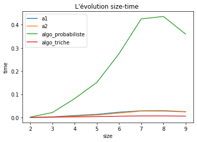
    


```python
list_t1,list_t2,list_t3,list_t4=[],[],[],[]
list_iter1,list_iter2,list_iter3,list_iter4=[],[],[],[]
for n in range(4,10):
    di=deepcopy(dictionnary[n])
    np.random.shuffle(di)
    list_mot=np.array(di[:nb_word])
    #list_mot=np.array(dictionnary[n])
    list_domain=[list(set(np.array(list_mot)[:,i] )) for i in range(n) ]
    sl_iter1,sl_iter2,sl_iter3,sl_iter4=[],[],[],[]
    sl_t1, sl_t2,sl_t3,sl_t4=[],[],[],[]
    print("n = ",n)
    for i in range(100):
        
        word=list_mot[np.random.randint(list_mot.shape[0])]
        start = time.time()
        sl_iter1.append(solver_a1(word,list_mot,list_domain,render=1))
        stop = time.time()
        sl_t1.append(stop-start)
                        
        start = time.time()
        sl_iter2.append(solver_a2(word,list_mot,list_domain,render=1))
        stop = time.time()
        sl_t2.append(stop-start)
        start = time.time()
        sl_iter3.append(solver_csp_probabiliste(word,list_mot,list_domain,render=1))
        stop = time.time()
        sl_t3.append(stop-start)
        start = time.time()
        sl_iter4.append(solver_triche(word,list_mot,list_domain,render=1))
        stop = time.time()
        sl_t4.append(stop-start)
        #print("============Word ",i+1,"Found===============")
    list_iter1.append(np.mean(sl_iter1))
    list_iter2.append(np.mean(sl_iter2))
    list_iter3.append(np.mean(sl_iter3))
    list_iter4.append(np.mean(sl_iter4))
    list_t1.append(np.mean(sl_t1))
    list_t2.append(np.mean(sl_t2))
    list_t3.append(np.mean(sl_t3))
    list_t4.append(np.mean(sl_t4))
```

    n =  4
    n =  5
    n =  6
    n =  7
    n =  8
    n =  9


## Comparer a1 a2 algo probabiliste et algo triche avec nombre de mots égaux


```python
n_range=[i for i in range(4,(10))]
plt.plot(n_range,list_iter1, label="a1")
plt.plot(n_range,list_iter2, label="a2")
plt.plot(n_range,list_iter3, label="algo_probabiliste")
plt.plot(n_range,list_iter4, label="algo_triche")
plt.title("L'évolution size-iterations avec nombre de mots égaux")
plt.xlabel("size")
plt.ylabel("iteration")
plt.legend()
plt.show()
```


    
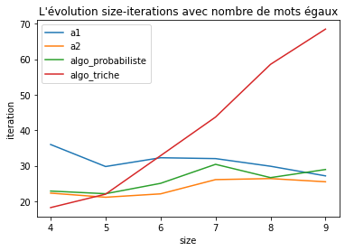
    


```python
n_range=[i for i in range(4,(10))]
plt.plot(n_range,list_t1, label="a1")
plt.plot(n_range,list_t2, label="a2")
plt.plot(n_range,list_t3, label="algo_probabiliste")
plt.plot(n_range,list_t4, label="algo_triche")
plt.title("L'évolution size-time avec nombre de mots égaux")
plt.xlabel("size")
plt.ylabel("time")
plt.legend()
plt.show()
```


    
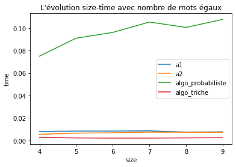
    


```python
list_iter2,list_iter3=[],[]
max_l2,max_l3=[],[]
min_l2,min_l3=[],[]
for n in range(4,10):
    di=deepcopy(dictionnary[n])
    np.random.shuffle(di)
    list_mot=np.array(di[:nb_word])
    #list_mot=np.array(dictionnary[n])
    list_domain=[list(set(np.array(list_mot)[:,i] )) for i in range(n) ]
    sl_iter2,sl_iter3=[],[]
    sl_t2,sl_t3=[],[]
    print("n = ",n)
    for i in range(100):
        
        word=list_mot[np.random.randint(list_mot.shape[0])]
 
        sl_iter2.append(solver_a2(word,list_mot,list_domain,render=1))
 
        
        sl_iter3.append(solver_csp_probabiliste(word,list_mot,list_domain,render=1))

 
    max_l2.append(np.max(sl_iter2))
    max_l3.append(np.max(sl_iter3))
    min_l2.append(np.min(sl_iter2))
    min_l3.append(np.min(sl_iter3))
    list_iter2.append(np.mean(sl_iter2))
    list_iter3.append(np.mean(sl_iter3))
    


```

    n =  4
    n =  5
    n =  6
    n =  7
    n =  8
    n =  9


## Comparer a2 a3 par max et min


```python
n_range=[i for i in range(4,(10))]
plt.plot(n_range,list_iter2, label="a2")
plt.fill_between(n_range, max_l2,min_l2, alpha=0.25, linewidth=0,)
plt.plot(n_range,list_iter3, label="algo probabiliste")


plt.fill_between(n_range, max_l3,min_l3, alpha=0.25, linewidth=0,)


plt.title("L'évolution size-time avec nombre de mots égaux")
plt.xlabel("size")
plt.ylabel("time")
plt.legend()
plt.show()
```


    
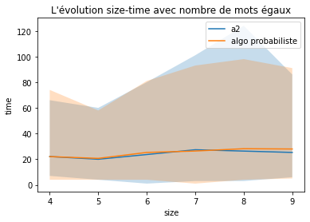
    


```python
n_range=[i for i in range(4,(10))]
plt.plot(n_range,list_iter3, label="algo probabiliste")
plt.fill_between(n_range, max_l3,min_l3, alpha=0.25, linewidth=0,)
plt.xlabel("size")
plt.ylabel("time")
plt.legend()
plt.show()
```


    
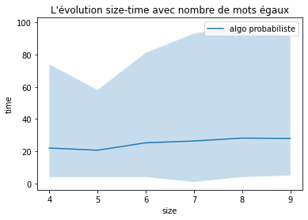
    


```python
#!/usr/bin/env python
# coding: utf-8

from constraint import *
import numpy as np
import string, random
import copy
import time


###### Partie 1 : Prepare list_domaine
def readfile(file):
    lines=[]
    dic_file=dict()
    with open(file) as f:
        for line in f:
            #print(line.rstrip())
            word=list(line.rstrip())#.split('')
            lg_word=len(word)
            if lg_word in dic_file:
                dic_file[lg_word].append(word)
            else:
                dic_file[lg_word]=[word]
    return dic_file

def check_correct(instance, word):
    bien_place=0
    mal_place=0
    list_not_match1=[]
    list_not_match2=[]
    for i in range(len(instance)):
        if instance[i]==word[i]:
            bien_place+=1
        else:
            list_not_match1.append(instance[i])
            list_not_match2.append(word[i])
    for letter in list_not_match1:
        if letter in list_not_match2:
            list_not_match2.remove(letter)
            mal_place+=1
    return bien_place, mal_place

def dict_to_liste_solution(solution , n):
    l=[]
    for i in range(n):
        l.append(solution["x"+str(i)])
    return l

dictionnary=readfile('./dico.txt')
#print(dictionnary[4])

#assert((check_correct("tarte","dette"))==(2,1))
#assert((check_correct("bonjour","nobjour")==(5,2)))

def find_bien_place(solution, n, bien_place, list_index, word):
    for i in range(n):
        if i not in list_index:
            avant=solution[i]
            solution[i]="_"
            bien_place_new,_ =check_correct(solution, word)
            if bien_place_new<bien_place:
                solution[i]=avant
                return i
    print("Erreur : func_find_bien_place")

###### Partie 2 : algorithme genetique
# 
# evaluation_distance✅
# fitness [可能可以优化]
# selection ✅
# mutation_aleatoire✅
# mutation_echange ✅
# mutation_inverse ✅
# croisement ✅
# 
# 

def evaluation_distance(str1,str2):
    '''
        calcul distance d'edition 计算两个字符串间的需要编辑的距离
        fitness = 1 - mot non bien place/len(mot)  需要更改的字母数/总字母数
    '''
    n = str1.__len__()
    distance = np.zeros((n+1,n+1))

    for i in range(0,n+1):
        distance[i,0] = i
        distance[0,i] = i
    
    for i in range(1, n+1):
        for j in range(1,n+1):
            if str1[i-1] == str2[j-1]:
                cost = 0
            else:
                cost = 1
            distance[i,j] = min(distance[i-1,j]+1,distance[i,j-1]+1,distance[i-1,j-1]+cost)
    
    return distance[n,n]

def fitness(solution,word):
    return 1- evaluation_distance(solution,word)/len(word)

def mutation(solution,p_mutation_alea,p_mutation_echange,p_mutation_inverse):
    p = np.random.random()
    n = len(solution)
    #print('valuer p',p)
    new_solution = []
    if p<p_mutation_alea:
        #print('mutation  : alea')
        new_solution = aleatoire(solution)
    if p>p_mutation_alea and p<p_mutation_echange:
        #print('mutation  : echange')
        new_solution = echange(solution)
    if p>p_mutation_echange and p < p_mutation_inverse:
        #print('mutation  : inverse')
        new_solution = inverse(solution)
    else: 
        new_solution = solution
    return new_solution

def aleatoire(str):
    new_str = []
    n = len(str)
    #print('lenth',n)
    pos = random.randint(0,n-1)
    #print(pos)
    l = random.choice(string.ascii_lowercase)
    #print(l)
    #str[pos] = l 
    part_1 = list(str[0:pos])
    part_2 = list(str[pos+1:])
    new_str = part_1+list(l)+part_2
    new_str = ''.join(new_str)
    #print('new str =', new_str)
    return new_str

def echange(str):
    n = len(str)
    str = list(str)
    #print(n)
    pos1 = np.random.randint(0,n)
    pos2 = np.random.randint(0,n)
    pos1,pos2 = min(pos1,pos2),max(pos1,pos2)
    #print(pos1,pos2)
    str[pos1],str[pos2] = str[pos2],str[pos1]
    #new_str = str[0:pos1]+str[pos2]+str[pos1+1:pos2]+str[pos1]+str[pos2+1:]
    #print(new_str)
    new_str = ''.join(str)
    #print('new str =', new_str)
    return new_str

def inverse(str):
    str = list(str)
    #print(len(str))
    left = random.randint(0,len(str)-1)
    right = random.randint(left,len(str)-1)
    #print(left,right)
    while left < right:
        str[left], str[right] = str[right], str[left]
        left += 1
        right -= 1
    #print(str)
    new_str = ''.join(str)
    #print(new_str)
    return new_str


nb_selecte = 1

def selection(word,parents,nb = nb_selecte):
#或者用somme cumulee也可以
    l_fitness = {}
    select_value = []
    for i in range(len(parents)):
        l_fitness[parents[i]] = fitness(parents[i],word)
    #print('list fitness',l_fitness)
    value_list = []
    for key,value in l_fitness.items():
        v = int(value * 100)
        value_list += v*[key]
    #print('value_list',value_list)
    if value_list == []: 
        #print('null')
        value_list = parents
    for i in range(nb):
        select_value.append(random.choice(value_list))
    return select_value


def croisement_fonde(p1, p2, p=-1):
    p1,p2 = list(p1),list(p2)
    if p==-1:
        p=np.random.randint(len(p1))
    f1=p1[:p]
    p2_new=p2
    p2_new=[i for i in p2_new if i not in f1]
    f1=f1+p2_new
    f2=p2[:p]
    p1_new=p1
    p1_new=[i for i in p1_new if (i not in f2)]
    f2=f2+p1_new
    return f1,f2


# longeur : la longeur de mot secret 
# _mu : nombre de parent
# _lambda : nombre de fils
# population initiale

def algo_genetique(word,_mu,_lambda,p_mutation_alea=0.25,p_mutation_echange=0.5,p_mutation_inverse = 0.75):
    '''
    Etant donnée une population d'individus E avec fitness > 0
    il s'agit de prendre les '_mu' meilleurs avec une propabilite propotionnelle à fitness , puis de créer _lambda enfants. 
    Chaque enfant aura pour parent l'un des _mu parents (sélectionné propotionnelle a fitness).
    La population E à la génération suivante sera ajouter les enfants.
    '''
    nb_essais = 0
    start = time.time()
    runtime = 0
    parents = []
    longeur = len(word)
    list_mot=np.array(dictionnary[longeur])
    list_domain=[set(list_mot[:,i]) for i in range(longeur)]
    #for i in range(longeur):
    #    print(len(list_domain[i]))

    #for i in range(len(list_domain)):
        #print('len domain before ',len(list_domain[i]))
    # generate parents

    for j in range(_mu):
        p1 = [a for a in range(longeur)]
        for i in range(longeur):
            #print('variable ',i)
            p1[i] = random.sample(list_domain[i],1)    
            p1[i] = ''.join(p1[i])
        p2 = ''.join(p1)
        #print('p2',p2)
        #print('parents before while',parents)
        #print('tmp',tmp,'p1',p1)
        while fitness(p2,word) == 0 or p2 in parents:
            #print('while ')
            nb_essais += 1
            if fitness(p2,word) == 0 :
                #print('fitness 0',p2 )
                for i in range(longeur):
                    list_domain[i].remove(p1[i])
                    p1[i] = random.sample(list_domain[i],1)
                    p1[i] = ''.join(p1[i])
            elif(p2 in parents): 
                #print('p2 in parents',p2)
                for i in range(longeur):
                    p1[i] = random.sample(list_domain[i],1)
                    p1[i] = ''.join(p1[i])   
            p2 = ''.join(p1)
            #print('p1',p1)
            #print(p1 in parents)
        #print('---------p1',p1)
        p2 = p1
        p2 = ''.join(p2)
        #print('---------p2 jion',p2)
        tmp = copy.deepcopy(''.join(p1))
        parents.append(tmp)
        #print(parents)
        #print(list_domain)
        #for i in range(len(list_domain)):
            #print('list domain',len(list_domain[i]),list_domain[i])   

        if word in parents:
            print('trouve!')
            break
    print('--------------generation finish, parents: ',parents)
    #return parents,fitness

    #generate fils
    nb_generation = 0
    while (word not in parents) and (nb_generation < MAXGEN) and (runtime < MAXTIME) and (len(parents) < MAXSIZE):
    #for k in range(nb_generation):
        #print('-----------------generation',nb_generation)
        nb_generation += 1
        for i in range(_lambda):
            #print('iteration', i)
            select_p1 = selection(word,parents,1)
            #print('select p1',select_p1)
            select_p1 = ''.join(select_p1)
            #print('mutation p1',select_p1)
            select_p1 = mutation(select_p1,p_mutation_alea,p_mutation_echange,p_mutation_inverse)
            if (fitness(select_p1,word))==0:
                nb_essais += 1
                select_change = list(select_p1)
                for i in range(longeur):
                    if select_change[i] in list_domain[i]:
                        list_domain[i].remove(select_change[i])
                        select_change[i] = random.sample(list_domain[i],1)
                        select_change[i] = ''.join(select_p1[i])
            elif(select_p1 in parents):
                nb_essais += 1
                #print('select_change in parents',select_p1)
                select_change = list(select_p1)
                for i in range(longeur):
                    select_change[i] = random.sample(list_domain[i],1)
                    select_change[i] = ''.join(select_change[i])   
            else: 
                parents.append(select_p1)
            #print('new parents',parents)
        end = time.time()
        runtime = end - start
        print(runtime)


        #for i in range(len(list_domain)):
            #print('list domain',len(list_domain[i]),list_domain[i])   


    print('finale E length=',len(parents),'nb_generation=',nb_generation,'runtime=',runtime,'nombre essais=',nb_essais)
    #print('E est',set(parents))

    if word in parents: print('trouve!')
    if nb_generation >= MAXGEN: print('nombre generation > MAXGEN',MAXGEN)
    if runtime >= MAXTIME : print('runtime > MAXTIME',MAXTIME)
    if len(parents) >= MAXSIZE : print('E plus grand que MAXSIZE',MAXSIZE)

    #l_fitness = {}
    #for i in range(len(parents)):
    #    l_fitness[parents[i]] = fitness(parents[i],word)
    #print(l_fitness)
   
    return parents,nb_generation,runtime,nb_essais #,l_fitness

p_mutation_alea = 0.25
p_mutation_echange  = 0.5
p_mutation_inverse = 0.75
MAXSIZE = 500
MAXGEN = 100
MAXTIME = 180 #3 minutes

#E,gen,t,iter = algo_genetique('psiss',30,10)
test_list = 8
list_tt, list_iter = [],[]
iter,tt = [],[]
for longeur in range(2,9):
    print(longeur,'longeur')
    for i in range(10):
        list_mot = np.array(dictionnary[longeur])
        word = list_mot[np.random.randint(list_mot.shape[0])]
        word = ''.join(word)
        E,gen,t,iteration = algo_genetique(word,30,10)
        tt.append(t) 
        iter.append(iteration)
    list_tt.append(np.mean(tt))
    print(list_tt)
    list_iter.append(np.mean(iter))
    print(list_iter)


```

    2 longeur
    trouve!
    --------------generation finish, parents:  ['mh', 'mk', 'mi', 'my']
    finale E length= 4 nb_generation= 0 runtime= 0 nombre essais= 22
    trouve!
    trouve!
    --------------generation finish, parents:  ['ii', 'hg', 'hi']
    finale E length= 3 nb_generation= 0 runtime= 0 nombre essais= 16
    trouve!
    trouve!
    --------------generation finish, parents:  ['ne', 'nt', 'no']
    finale E length= 3 nb_generation= 0 runtime= 0 nombre essais= 21
    trouve!
    trouve!
    --------------generation finish, parents:  ['io', 'bt', 'ih', 'it']
    finale E length= 4 nb_generation= 0 runtime= 0 nombre essais= 15
    trouve!
    trouve!
    --------------generation finish, parents:  ['wu', 'wh', 'wk', 'wo', 'we']
    finale E length= 5 nb_generation= 0 runtime= 0 nombre essais= 16
    trouve!
    trouve!
    --------------generation finish, parents:  ['bx', 'hx', 'mx', 'ou', 'ox']
    finale E length= 5 nb_generation= 0 runtime= 0 nombre essais= 16
    trouve!
    trouve!
    --------------generation finish, parents:  ['yo', 'sy', 'bo', 'sn', 'sx', 'so']
    finale E length= 6 nb_generation= 0 runtime= 0 nombre essais= 16
    trouve!
    trouve!
    --------------generation finish, parents:  ['iu', 'ot', 'ia', 'it']
    finale E length= 4 nb_generation= 0 runtime= 0 nombre essais= 15
    trouve!
    trouve!
    --------------generation finish, parents:  ['ni', 'nu']
    finale E length= 2 nb_generation= 0 runtime= 0 nombre essais= 18
    trouve!
    trouve!
    --------------generation finish, parents:  ['ag', 'au', 'ah']
    finale E length= 3 nb_generation= 0 runtime= 0 nombre essais= 16
    trouve!
    [0.0]
    [17.1]
    3 longeur
    trouve!
    --------------generation finish, parents:  ['rab', 'wad', 'gan', 'gss', 'iad', 'rag', 'gad', 'pal', 'rad', 'gal', 'pad', 'pag', 'ral', 'gag']
    finale E length= 14 nb_generation= 0 runtime= 0 nombre essais= 49
    trouve!
    trouve!
    --------------generation finish, parents:  ['noo', 'ccx', 'cxo', 'cnw', 'cxz', 'doe', 'cbw', 'dbb', 'cpi', 'coo', 'qoz', 'dxb', 'doz', 'cob']
    finale E length= 14 nb_generation= 0 runtime= 0 nombre essais= 25
    trouve!
    trouve!
    --------------generation finish, parents:  ['pam', 'rvt', 'ues', 'kek', 'vev', 'eek', 'vpm', 'rpu', 'reu', 'seg', 'vem', 'veu', 'rem']
    finale E length= 13 nb_generation= 0 runtime= 0 nombre essais= 27
    trouve!
    trouve!
    --------------generation finish, parents:  ['eib', 'vtd', 'htl', 'hib', 'htv', 'hdb', 'ybd', 'eiv', 'hid']
    finale E length= 9 nb_generation= 0 runtime= 0 nombre essais= 19
    trouve!
    trouve!
    --------------generation finish, parents:  ['rgm', 'aor', 'rgn', 'bgn', 'jro', 'avt', 'zgx', 'ign', 'tgn', 'igm', 'ago']
    finale E length= 11 nb_generation= 0 runtime= 0 nombre essais= 25
    trouve!
    trouve!
    --------------generation finish, parents:  ['uoe', 'cyt', 'cux', 'cyn', 'cyo', 'gon', 'clw', 'doo', 'cyl', 'tlo', 'tob', 'gob', 'coo']
    finale E length= 13 nb_generation= 0 runtime= 0 nombre essais= 22
    trouve!
    trouve!
    --------------generation finish, parents:  ['wpm', 'yaz', 'wiv', 'odx', 'kam', 'gdx', 'hab', 'wli', 'ylx', 'wnx', 'wwz', 'ynx', 'yay', 'hnx', 'wax']
    finale E length= 15 nb_generation= 0 runtime= 0 nombre essais= 21
    trouve!
    trouve!
    --------------generation finish, parents:  ['kwh', 'lio', 'eki', 'kmx', 'emt', 'eiz', 'yiv', 'kmt', 'kir', 'sit', 'kii', 'kit']
    finale E length= 12 nb_generation= 0 runtime= 0 nombre essais= 23
    trouve!
    trouve!
    --------------generation finish, parents:  ['pco', 'jep', 'adt', 'yev', 'uec', 'zex', 'ptt', 'jet', 'pec', 'pej', 'zet', 'zec', 'jec', 'jej', 'zej', 'pet']
    finale E length= 16 nb_generation= 0 runtime= 0 nombre essais= 41
    trouve!
    trouve!
    --------------generation finish, parents:  ['zld', 'tgd', 'kef', 'rpd', 'qpd', 'qed', 'iec', 'qec', 'ted']
    finale E length= 9 nb_generation= 0 runtime= 0 nombre essais= 22
    trouve!
    [0.0, 0.0]
    [17.1, 22.25]
    4 longeur
    trouve!
    --------------generation finish, parents:  ['perc', 'eexw', 'flus', 'iuht', 'zusy', 'easm', 'kzsf', 'kxut', 'hzsd', 'hesb', 'lund', 'hbut', 'hekt', 'cend', 'nbut', 'cxnt', 'lxnb', 'nenb', 'nbst', 'lbst', 'lest']
    finale E length= 21 nb_generation= 0 runtime= 0 nombre essais= 28
    trouve!
    trouve!
    --------------generation finish, parents:  ['beos', 'lkty', 'eztk', 'deru', 'puzp', 'tptp', 'mdtz', 'putq', 'tytz', 'pdhq', 'ppts', 'deds', 'pets']
    finale E length= 13 nb_generation= 0 runtime= 0 nombre essais= 24
    trouve!
    trouve!
    --------------generation finish, parents:  ['fpbb', 'cipp', 'fpbx', 'hlxx', 'ulkl', 'usoh', 'bzox', 'qlih', 'qpox', 'wxip', 'qmop', 'qpoh', 'fxop', 'slop', 'sxop', 'flop']
    finale E length= 16 nb_generation= 0 runtime= 0 nombre essais= 28
    trouve!
    trouve!
    --------------generation finish, parents:  ['eanv', 'oamk', 'ywvs', 'jass', 'yurh', 'aaes', 'jujs', 'jjkh', 'jash', 'zars', 'jvrh', 'qaas', 'qbrh', 'garh', 'gjrw', 'jpsh', 'jprh', 'wvrs', 'wjrw', 'zpss', 'wars', 'jjss', 'wjss', 'jarw', 'zprs', 'jprs', 'jars']
    finale E length= 27 nb_generation= 0 runtime= 0 nombre essais= 26
    trouve!
    trouve!
    --------------generation finish, parents:  ['cepo', 'jkkr', 'hokw', 'caai', 'kofo', 'jikr', 'wohd', 'cakv', 'jjko', 'wqhe', 'hoxo', 'code', 'jake', 'roke', 'cake', 'jike', 'joke', 'cike', 'coke']
    finale E length= 19 nb_generation= 0 runtime= 0 nombre essais= 29
    trouve!
    trouve!
    --------------generation finish, parents:  ['wyig', 'woyt', 'dgnm', 'sgrl', 'honh', 'swiz', 'ujnn', 'swnh', 'zing', 'zxnh', 'rxnh', 'hojg', 'hxnh', 'song']
    finale E length= 14 nb_generation= 0 runtime= 0 nombre essais= 23
    trouve!
    trouve!
    --------------generation finish, parents:  ['seuu', 'ddgg', 'iipx', 'jwnp', 'syyz', 'bjxg', 'isni', 'hzne', 'igxg', 'rsnq', 'ding', 'rxyg', 'rgng', 'rxng', 'diyz', 'dgyg', 'dinz', 'sgng', 'sinz', 'rgyg', 'sxyz', 'sgnz', 'sing']
    finale E length= 23 nb_generation= 0 runtime= 0 nombre essais= 26
    trouve!
    trouve!
    --------------generation finish, parents:  ['jtlt', 'xtst', 'imoi', 'hwow', 'kjot', 'hnoe', 'gnom', 'dmoe', 'gpot', 'suot', 'sceo', 'huot', 'swot']
    finale E length= 13 nb_generation= 0 runtime= 0 nombre essais= 25
    trouve!
    trouve!
    --------------generation finish, parents:  ['tkym', 'iqto', 'jwkt', 'stiz', 'ttit', 'fint', 'tybv', 'tynz', 'yixp', 'yqnv', 'wwkt', 'fsct', 'tikz', 'etnt', 'tqtn', 'fqnv', 'fikt', 'ysnv', 'tikn', 'ytnt', 'tqnz', 'epnz', 'apkt', 'ypxt', 'ttnt', 'yint', 'tint']
    finale E length= 27 nb_generation= 0 runtime= 0 nombre essais= 27
    trouve!
    trouve!
    --------------generation finish, parents:  ['oojv', 'gemw', 'gxlv', 'goex', 'goec', 'xces', 'uoev', 'gwex', 'qwvs', 'gcvu', 'gwes', 'goes']
    finale E length= 12 nb_generation= 0 runtime= 0 nombre essais= 24
    trouve!
    [0.0, 0.0, 0.0]
    [17.1, 22.25, 23.5]
    5 longeur
    --------------generation finish, parents:  ['uzitw', 'shwxe', 'srtpu', 'wdhro', 'titio', 'tpvio', 'svtio', 'fitie', 'spmge', 'fvmge', 'tcvre', 'fvtge', 'fvtre', 'tvage', 'fvvie', 'scare', 'fcvie', 'siaie', 'fiaie', 'svage', 'sitge', 'tvvge', 'fcvge', 'tivre', 'siage', 'fvvge', 'titie', 'tcage', 'fitre', 'fiare']
    0.03664684295654297
    0.05341291427612305
    0.0689857006072998
    0.0873708724975586
    0.10557270050048828
    0.1293199062347412
    0.15438175201416016
    0.18011188507080078
    0.1999969482421875
    0.2200007438659668
    0.24037790298461914
    0.2630178928375244
    0.28493475914001465
    0.30671072006225586
    0.3324007987976074
    0.35985374450683594
    0.385347843170166
    0.4099736213684082
    0.4325988292694092
    0.4589977264404297
    0.48387789726257324
    0.5099787712097168
    0.5384318828582764
    0.5643367767333984
    0.596390962600708
    0.628349781036377
    0.6583359241485596
    0.6864819526672363
    0.7157278060913086
    0.7451217174530029
    0.7757976055145264
    0.8032777309417725
    0.8343229293823242
    0.8716187477111816
    0.9038078784942627
    0.9331607818603516
    0.9649538993835449
    0.9962267875671387
    1.0265557765960693
    1.0556669235229492
    1.0891096591949463
    1.1216557025909424
    1.1553547382354736
    1.195281744003296
    1.2322986125946045
    1.2824208736419678
    1.324659824371338
    1.371211051940918
    1.4103407859802246
    1.4457926750183105
    1.4801957607269287
    1.5212149620056152
    1.566269874572754
    1.6177477836608887
    1.6656126976013184
    1.703434944152832
    1.7449588775634766
    1.7870378494262695
    1.8358500003814697
    1.888077735900879
    1.9339168071746826
    1.9743785858154297
    2.013483762741089
    2.055300712585449
    2.1036248207092285
    2.1544530391693115
    2.2161128520965576
    2.2796707153320312
    2.335645914077759
    2.3909127712249756
    2.4341750144958496
    2.4803426265716553
    2.526561737060547
    2.578544855117798
    2.629014730453491
    2.6827216148376465
    2.7341368198394775
    2.79257869720459
    2.8429548740386963
    2.8946878910064697
    2.9439167976379395
    2.995983839035034
    3.047583818435669
    3.112238883972168
    3.176499843597412
    3.229811906814575
    3.2803189754486084
    3.33101487159729
    3.385206699371338
    3.442340850830078
    3.4935739040374756
    3.5457987785339355
    3.603895664215088
    3.670804977416992
    3.728949785232544
    3.7831828594207764
    3.8437037467956543
    3.9086527824401855
    3.9661667346954346
    4.02362585067749
    finale E length= 125 nb_generation= 100 runtime= 4.02362585067749 nombre essais= 932
    nombre generation > MAXGEN 100
    trouve!
    --------------generation finish, parents:  ['htskb', 'saxgu', 'ktssr', 'hhgls', 'ctglg', 'zonrs', 'cvikx', 'bazze', 'daxix', 'luskn', 'tadlx', 'eugls', 'ealbn', 'tudbs', 'tagfs', 'eadks', 'tadbs', 'hagks', 'csgks', 'calfs', 'ccdmn', 'calks', 'casks']
    finale E length= 23 nb_generation= 0 runtime= 0 nombre essais= 23
    trouve!
    --------------generation finish, parents:  ['fpwbz', 'zriza', 'fioib', 'ilron', 'slgea', 'aebqs', 'ifrke', 'seree', 'swbes', 'iydgs', 'lfiqn', 'ffdes', 'vliks', 'iygen', 'ffdgs', 'ifdgs', 'fldes', 'iyqks', 'fyigs', 'iyigs', 'ffdks', 'vyqks', 'vyies', 'ifqes', 'vfqks', 'vlqgs', 'ffiks', 'iydks', 'vldgs', 'vfqgs']
    0.03227114677429199
    0.047910213470458984
    0.0656273365020752
    0.08689427375793457
    0.10815215110778809
    0.1341991424560547
    0.1551821231842041
    0.1754753589630127
    0.1941063404083252
    0.21117424964904785
    0.22957825660705566
    0.24724817276000977
    0.26563024520874023
    0.29012513160705566
    0.31244921684265137
    0.3381493091583252
    0.36279821395874023
    0.38512420654296875
    0.41066908836364746
    0.43366026878356934
    0.45834803581237793
    0.48199915885925293
    0.5067262649536133
    0.5296051502227783
    0.5582191944122314
    0.5848093032836914
    0.6120412349700928
    0.6393721103668213
    0.6648001670837402
    0.6928102970123291
    0.7198891639709473
    0.7477240562438965
    0.7808670997619629
    0.822789192199707
    0.8624560832977295
    0.9098522663116455
    0.957862138748169
    1.0080361366271973
    1.0488371849060059
    1.0889813899993896
    1.124131202697754
    1.1607253551483154
    1.1964411735534668
    1.235842227935791
    1.2746024131774902
    1.3161931037902832
    1.3600530624389648
    1.3928632736206055
    1.4251751899719238
    1.4585683345794678
    1.4911863803863525
    1.525071144104004
    1.5650382041931152
    1.6139891147613525
    1.6600532531738281
    1.698418378829956
    1.7335700988769531
    1.7722933292388916
    1.8124322891235352
    1.8653922080993652
    1.9161362648010254
    1.9610512256622314
    2.0009841918945312
    2.0408613681793213
    2.086459159851074
    2.126681089401245
    2.1673710346221924
    2.259463310241699
    2.3001391887664795
    2.3474602699279785
    2.3973281383514404
    2.448711395263672
    2.5177762508392334
    2.5830862522125244
    2.647278308868408
    2.7037222385406494
    2.750688076019287
    2.8122072219848633
    2.8793952465057373
    2.9343762397766113
    2.9811441898345947
    3.0315093994140625
    3.0784671306610107
    3.1397502422332764
    3.201331377029419
    3.2509422302246094
    3.302481174468994
    3.359243154525757
    3.4209542274475098
    3.4885692596435547
    3.5536372661590576
    3.629019260406494
    3.725783109664917
    3.7937991619110107
    3.8571834564208984
    3.919236183166504
    3.983262300491333
    4.050215244293213
    4.117013454437256
    4.183934211730957
    finale E length= 113 nb_generation= 100 runtime= 4.183934211730957 nombre essais= 941
    nombre generation > MAXGEN 100
    --------------generation finish, parents:  ['xopsb', 'gtasg', 'tyqzr', 'ofgcs', 'tfqsp', 'cnesz', 'xrtkv', 'xlbso', 'vnbas', 'qoesv', 'bwuvs', 'ttecs', 'bwevs', 'irocs', 'truvs', 'bouss', 'iwovs', 'irucs', 'iwevs', 'iwuss', 'toess', 'ioucs', 'toucs', 'brevs', 'brucs', 'bruss', 'iruss', 'bwess', 'iooss', 'irecs']
    0.0341038703918457
    0.04994988441467285
    0.06557893753051758
    0.08146190643310547
    0.09823393821716309
    0.11764287948608398
    0.14010906219482422
    0.16525673866271973
    0.18749594688415527
    0.20725393295288086
    0.22696375846862793
    0.24707388877868652
    0.26674389839172363
    0.28975796699523926
    0.31264615058898926
    0.3373990058898926
    0.36762094497680664
    0.39884209632873535
    0.43891191482543945
    0.47451281547546387
    0.5079290866851807
    0.5513818264007568
    0.5883040428161621
    0.6246588230133057
    0.6661009788513184
    0.7082347869873047
    0.7465028762817383
    0.7839169502258301
    0.8242318630218506
    0.86580491065979
    0.9122858047485352
    0.9572467803955078
    1.0009310245513916
    1.0384559631347656
    1.0749948024749756
    1.1228830814361572
    1.174785852432251
    1.2305920124053955
    1.2853868007659912
    1.3348448276519775
    1.3814678192138672
    1.417335033416748
    1.4614379405975342
    1.5049231052398682
    1.5569839477539062
    1.6059870719909668
    1.6527259349822998
    1.72182297706604
    1.7912890911102295
    1.8684110641479492
    1.9372808933258057
    2.000441074371338
    2.066352128982544
    2.137525796890259
    2.210871934890747
    2.288796901702881
    2.352250099182129
    2.4113309383392334
    2.4760260581970215
    2.540076971054077
    2.612534999847412
    2.6767327785491943
    2.7413809299468994
    2.8107969760894775
    2.8709287643432617
    2.939786911010742
    3.032364845275879
    3.1199967861175537
    3.2052547931671143
    3.2793099880218506
    3.3562347888946533
    3.4259917736053467
    3.4985649585723877
    3.569917917251587
    3.640864849090576
    3.711215019226074
    3.774303913116455
    3.839263916015625
    3.90044903755188
    3.974289894104004
    4.049350023269653
    4.125094890594482
    4.1983747482299805
    4.269969701766968
    4.343947887420654
    4.4209630489349365
    4.501223802566528
    4.575800895690918
    4.653343915939331
    4.7323949337005615
    4.810459852218628
    4.887546062469482
    4.969546794891357
    5.041991949081421
    5.123270034790039
    5.1944639682769775
    5.263256072998047
    5.328574895858765
    5.392406940460205
    5.459533929824829
    finale E length= 125 nb_generation= 100 runtime= 5.459533929824829 nombre essais= 930
    nombre generation > MAXGEN 100
    --------------generation finish, parents:  ['znkhs', 'pbgho', 'rnkrs', 'elars', 'plgrs', 'zbahs', 'pbkxn', 'zbods', 'engrs', 'ragxs', 'elodn', 'zlads', 'pakds', 'plohs', 'pnads', 'rnods', 'paaxn', 'raodn', 'znadn', 'zngxs', 'elgrn', 'rnkhs', 'eaods', 'eakdn', 'eaars', 'pbkhs', 'zagds', 'rnors', 'pnods', 'zbors']
    0.03867316246032715
    0.05942487716674805
    0.08120393753051758
    0.1047358512878418
    0.12444400787353516
    0.14760398864746094
    0.17008399963378906
    0.19407892227172852
    0.21783018112182617
    0.24003195762634277
    0.26781487464904785
    0.29132890701293945
    0.3138749599456787
    0.33969879150390625
    0.36856913566589355
    0.41855883598327637
    0.45835304260253906
    0.49478912353515625
    0.5306501388549805
    0.569342851638794
    0.6005549430847168
    0.6320619583129883
    0.6621849536895752
    0.6932590007781982
    0.7244288921356201
    0.7534780502319336
    0.7835900783538818
    0.818098783493042
    0.8586370944976807
    0.9037590026855469
    0.9506800174713135
    0.9921121597290039
    1.0338859558105469
    1.0755019187927246
    1.1198399066925049
    1.162632942199707
    1.206385850906372
    1.248295783996582
    1.2910330295562744
    1.328632116317749
    1.3662629127502441
    1.4025452136993408
    1.4459052085876465
    1.485701084136963
    1.5262749195098877
    1.5762979984283447
    1.6232759952545166
    1.6711721420288086
    1.717264175415039
    1.7606871128082275
    1.8036479949951172
    1.8542959690093994
    1.9023211002349854
    1.9500939846038818
    2.0015201568603516
    2.060220956802368
    2.118398904800415
    2.1729729175567627
    2.2256381511688232
    2.281106948852539
    2.3428170680999756
    2.40903902053833
    2.469815969467163
    2.5281100273132324
    2.600764036178589
    2.6773600578308105
    2.7476449012756348
    2.8091177940368652
    2.8717219829559326
    2.9250190258026123
    2.9800829887390137
    3.028419017791748
    3.076770067214966
    3.12985897064209
    3.1872870922088623
    3.2480900287628174
    3.310235023498535
    3.3616230487823486
    3.4262259006500244
    3.49690318107605
    3.5523388385772705
    3.6018269062042236
    3.6533517837524414
    3.7165560722351074
    3.7810490131378174
    3.837703227996826
    3.897243022918701
    3.9608519077301025
    4.026711940765381
    4.080403804779053
    4.134131908416748
    4.198702096939087
    4.253597974777222
    4.307543992996216
    4.370159149169922
    4.436593770980835
    4.499942779541016
    4.557809114456177
    4.615747928619385
    4.676421165466309
    finale E length= 107 nb_generation= 100 runtime= 4.676421165466309 nombre essais= 948
    nombre generation > MAXGEN 100
    trouve!
    --------------generation finish, parents:  ['jfmev', 'wsmjn', 'rciyk', 'terbo', 'bnwux', 'rdodt', 'rvgmc', 'fdmtr', 'mbeps', 'mheus', 'revqv', 'meeqs', 'meejb', 'rheqv', 'felov', 'mevqb', 'reqqb', 'rblos', 'mvlys', 'fvvus', 'fhlus', 'mhlys', 'fvlos', 'fhvus', 'fvlus', 'rvvys', 'remus']
    finale E length= 27 nb_generation= 0 runtime= 0 nombre essais= 23
    trouve!
    --------------generation finish, parents:  ['wgdca', 'uluqk', 'kppcu', 'ckjgo', 'yficd', 'ulsvd', 'ckooo', 'jdutk', 'jkocx', 'cfcok', 'wvoch', 'udivk', 'kdcck', 'sjidk', 'cfpyx', 'jldys', 'sidvk', 'cpdyk', 'vplcp', 'cicvk', 'jlidk', 'vldcs', 'cilcs', 'clcbs', 'wllbk', 'wkdck', 'cidvk', 'wldck', 'jkibk', 'jiibk']
    0.04372572898864746
    0.06579279899597168
    0.08758401870727539
    0.10924172401428223
    0.1300668716430664
    0.14951562881469727
    0.17092585563659668
    0.19134187698364258
    0.2147846221923828
    0.2575337886810303
    0.2836439609527588
    0.30393075942993164
    0.3243546485900879
    0.3473379611968994
    0.3685629367828369
    0.3885188102722168
    0.4101448059082031
    0.43492674827575684
    0.4582667350769043
    0.48093271255493164
    0.5063598155975342
    0.5378577709197998
    0.5692858695983887
    0.5981760025024414
    0.6305217742919922
    0.6662726402282715
    0.7051117420196533
    0.7398018836975098
    0.7737417221069336
    0.8085978031158447
    0.8487088680267334
    0.8985416889190674
    0.9609589576721191
    0.9983477592468262
    1.0402467250823975
    1.086824893951416
    1.1258738040924072
    1.1657416820526123
    1.205430030822754
    1.2537128925323486
    1.296567678451538
    1.3373208045959473
    1.3745837211608887
    1.409726858139038
    1.4478888511657715
    1.4856629371643066
    1.5262207984924316
    1.5650177001953125
    1.600578784942627
    1.6398918628692627
    1.683743953704834
    1.7274539470672607
    1.7695918083190918
    1.8072059154510498
    1.8472237586975098
    1.8889667987823486
    1.9359407424926758
    1.9818029403686523
    2.0214438438415527
    2.0663349628448486
    2.110245943069458
    2.152683734893799
    2.1954429149627686
    2.239102840423584
    2.2888619899749756
    2.343273878097534
    2.3989408016204834
    2.4523699283599854
    2.5032308101654053
    2.5511538982391357
    2.6002278327941895
    2.6565539836883545
    2.703460693359375
    2.7569117546081543
    2.8125858306884766
    2.8589320182800293
    2.9123079776763916
    2.967357873916626
    3.0188329219818115
    3.068814754486084
    3.124433755874634
    3.185058832168579
    3.2595698833465576
    3.331554651260376
    3.41035795211792
    3.480834722518921
    3.539841651916504
    3.593784809112549
    3.6566920280456543
    3.734710693359375
    3.833662986755371
    3.9135797023773193
    3.992379903793335
    4.051432847976685
    4.108518838882446
    4.163823843002319
    4.219416856765747
    4.27423882484436
    4.332871913909912
    4.390275716781616
    finale E length= 119 nb_generation= 100 runtime= 4.390275716781616 nombre essais= 934
    nombre generation > MAXGEN 100
    --------------generation finish, parents:  ['jlsps', 'glssg', 'mtrto', 'fjoqw', 'ylrag', 'vdvbs', 'cjpte', 'blftu', 'feotf', 'rsotg', 'bfoeg', 'bnuui', 'bosms', 'cdoms', 'cofms', 'cdobs', 'hofbs', 'hdsms', 'hlfts', 'clobs', 'booms', 'bdsts', 'bdobs', 'cloms', 'hlsms', 'hloms', 'clsts', 'cdsbs', 'hofts', 'hdoms']
    0.03433585166931152
    0.04922008514404297
    0.06504106521606445
    0.08235001564025879
    0.09840607643127441
    0.11878490447998047
    0.13946318626403809
    0.15895795822143555
    0.18346786499023438
    0.20599794387817383
    0.24610304832458496
    0.36527085304260254
    0.4004950523376465
    0.4603738784790039
    0.4960329532623291
    0.5270140171051025
    0.5583400726318359
    0.5846371650695801
    0.6070189476013184
    0.6296560764312744
    0.6526761054992676
    0.6762659549713135
    0.700596809387207
    0.7251238822937012
    0.7526609897613525
    0.7813880443572998
    0.8082189559936523
    0.8365089893341064
    0.8653731346130371
    0.8946521282196045
    0.928333044052124
    0.9632527828216553
    0.9980099201202393
    1.0325050354003906
    1.062535047531128
    1.0930521488189697
    1.1249639987945557
    1.161609172821045
    1.2010228633880615
    1.2426509857177734
    1.2793240547180176
    1.314079999923706
    1.3500239849090576
    1.3872978687286377
    1.4248638153076172
    1.462501049041748
    1.5000622272491455
    1.5402779579162598
    1.5789830684661865
    1.6239678859710693
    1.667658805847168
    1.7081849575042725
    1.7506399154663086
    1.7998790740966797
    1.8477590084075928
    1.8917369842529297
    1.934417963027954
    1.977504014968872
    2.0196330547332764
    2.0626368522644043
    2.1091768741607666
    2.1603639125823975
    2.203268051147461
    2.245879888534546
    2.2883989810943604
    2.331960916519165
    2.378035068511963
    2.4273698329925537
    2.475437879562378
    2.5226879119873047
    2.5691099166870117
    2.6177918910980225
    2.6671321392059326
    2.715348958969116
    2.761521100997925
    2.809723138809204
    2.8616318702697754
    2.917353868484497
    2.9747440814971924
    3.035573959350586
    3.089529037475586
    3.141645908355713
    3.1899309158325195
    3.262409210205078
    3.3313891887664795
    3.3865911960601807
    3.443203926086426
    3.49167799949646
    3.5432229042053223
    3.605342149734497
    3.6687588691711426
    3.7200169563293457
    3.7736799716949463
    3.8307931423187256
    3.8993520736694336
    3.9667139053344727
    4.0331711769104
    4.097473859786987
    4.153641939163208
    4.207618951797485
    finale E length= 111 nb_generation= 100 runtime= 4.207618951797485 nombre essais= 943
    nombre generation > MAXGEN 100
    --------------generation finish, parents:  ['jzajl', 'altju', 'uxljs', 'umaus', 'upine', 'gpixe', 'uxpxs', 'gxpdt', 'tgbxs', 'tgaxs', 'tpbxs', 'upbns', 'ulans', 'ulprs', 'upbrs', 'gpbns', 'tgans', 'ugprs', 'ugaxs', 'upbxs', 'ugbrs', 'upans', 'tlars', 'glbrs', 'glaxs', 'tgpns', 'ggprs', 'ugpxs', 'ugpns', 'tgbrs']
    0.03475594520568848
    0.05073904991149902
    0.06663203239440918
    0.08379077911376953
    0.1036989688873291
    0.12289094924926758
    0.14342188835144043
    0.16267180442810059
    0.1817169189453125
    0.2034158706665039
    0.22539091110229492
    0.24607181549072266
    0.26549410820007324
    0.28487491607666016
    0.30582094192504883
    0.33184099197387695
    0.35657286643981934
    0.3842649459838867
    0.40973806381225586
    0.4467489719390869
    0.4785468578338623
    0.5107510089874268
    0.5382997989654541
    0.564054012298584
    0.5892589092254639
    0.61617112159729
    0.6438300609588623
    0.6713449954986572
    0.7001831531524658
    0.7300498485565186
    0.7579500675201416
    0.7857060432434082
    0.8147499561309814
    0.8457291126251221
    0.8751850128173828
    0.9045698642730713
    0.9362540245056152
    0.9683740139007568
    0.9965970516204834
    1.0339620113372803
    1.0683209896087646
    1.1030840873718262
    1.1415998935699463
    1.1793358325958252
    1.2183399200439453
    1.2586150169372559
    1.2965929508209229
    1.3378379344940186
    1.3765461444854736
    1.4147429466247559
    1.4591660499572754
    1.4985909461975098
    1.536728858947754
    1.5737848281860352
    1.6114859580993652
    1.6525540351867676
    1.6957898139953613
    1.7351057529449463
    1.7736918926239014
    1.8127448558807373
    1.8524119853973389
    1.8927888870239258
    1.9340648651123047
    1.9785399436950684
    2.020148992538452
    2.0625269412994385
    2.1065449714660645
    2.149509906768799
    2.193635940551758
    2.2362020015716553
    2.2786078453063965
    2.3234686851501465
    2.3670270442962646
    2.4137518405914307
    2.4579548835754395
    2.5021069049835205
    2.5466198921203613
    2.5919978618621826
    2.638819932937622
    2.684597969055176
    2.729362964630127
    2.776333808898926
    2.829105854034424
    2.8848519325256348
    2.946475028991699
    3.0061898231506348
    3.0607807636260986
    3.1136960983276367
    3.1693880558013916
    3.2299609184265137
    3.281169891357422
    3.3312458992004395
    3.3818318843841553
    3.4330897331237793
    3.4857380390167236
    3.537820816040039
    3.587667942047119
    3.637346029281616
    3.68837571144104
    3.741260051727295
    finale E length= 107 nb_generation= 100 runtime= 3.741260051727295 nombre essais= 948
    nombre generation > MAXGEN 100
    trouve!
    --------------generation finish, parents:  ['vrvsd', 'najyx', 'aldbz', 'taiau', 'ejvih', 'vmkhs', 'mvwlo', 'vblgo', 'qwqix', 'qwltx', 'alfix', 'dwfix', 'nlqih', 'zlqix', 'vllih', 'nllhh', 'allhd', 'aavhd', 'qwlid', 'qwvhd', 'aavid', 'qwfid', 'aalid', 'vlvid', 'valid']
    finale E length= 25 nb_generation= 0 runtime= 0 nombre essais= 24
    trouve!
    [0.0, 0.0, 0.0, 0.7670667469501495]
    [17.1, 22.25, 23.5, 183.775]
    6 longeur
    --------------generation finish, parents:  ['vhaybl', 'uawehg', 'zwrxyt', 'wbiezx', 'bexjaz', 'cgfmag', 'weeohz', 'bendbz', 'cwrdxa', 'beelwz', 'cwuexm', 'kpejal', 'cereaz', 'kpnoxl', 'cpueyz', 'zeceym', 'yweoal', 'ypeeyl', 'yguoam', 'cprmal', 'bermyl', 'beegal', 'bwuoal', 'bprmyl', 'cgcmyl', 'cgegal', 'zereal', 'cpeeal', 'yprgal', 'zeemal']
    0.05176424980163574
    0.07423806190490723
    0.0957491397857666
    0.11899209022521973
    0.1442699432373047
    0.17023205757141113
    0.19803404808044434
    0.22468185424804688
    0.25123119354248047
    0.2782771587371826
    0.30375003814697266
    0.3298661708831787
    0.3556861877441406
    0.3820180892944336
    0.41125917434692383
    0.4445481300354004
    0.4731559753417969
    0.5011250972747803
    0.5311651229858398
    0.563007116317749
    0.5956690311431885
    0.6297030448913574
    0.6648759841918945
    0.6995859146118164
    0.7337510585784912
    0.7723298072814941
    0.8124041557312012
    0.8529009819030762
    0.8966050148010254
    0.9440622329711914
    0.9935760498046875
    1.034452199935913
    1.0739810466766357
    1.1180059909820557
    1.1709020137786865
    1.2293291091918945
    1.3017680644989014
    1.3808209896087646
    1.456725835800171
    1.514474868774414
    1.58811616897583
    1.6447460651397705
    1.7083430290222168
    1.7821080684661865
    1.8515760898590088
    1.9053239822387695
    1.9572782516479492
    2.0127580165863037
    2.077989101409912
    2.151499032974243
    2.3474268913269043
    2.488223075866699
    2.617917060852051
    2.7100090980529785
    2.829555034637451
    2.9130449295043945
    2.994964838027954
    3.0849790573120117
    3.1610331535339355
    3.238452196121216
    3.32620906829834
    3.4108221530914307
    3.501732110977173
    3.5795791149139404
    3.6521871089935303
    3.726964235305786
    3.8162410259246826
    3.900470018386841
    3.9901061058044434
    4.0795440673828125
    4.164155006408691
    4.245578289031982
    4.330883026123047
    4.4357969760894775
    4.521221160888672
    4.606827974319458
    4.692770004272461
    4.777616024017334
    4.866920232772827
    4.970412015914917
    5.0645751953125
    5.160953998565674
    5.285940885543823
    5.39103102684021
    5.498328924179077
    5.60988712310791
    5.745006084442139
    5.864688158035278
    5.9634850025177
    6.0596230030059814
    6.1539318561553955
    6.255367040634155
    6.356184005737305
    6.453413963317871
    6.556647062301636
    6.754102945327759
    6.898504018783569
    7.043330907821655
    7.148319244384766
    7.254855155944824
    finale E length= 150 nb_generation= 100 runtime= 7.254855155944824 nombre essais= 903
    nombre generation > MAXGEN 100
    --------------generation finish, parents:  ['ocgmdg', 'sqnqib', 'htnqvg', 'wbdjkg', 'hrdicu', 'ewfhzt', 'erdpdv', 'wfhacg', 'vxcagg', 'rfhwgt', 'ywdwiv', 'booqiv', 'eovpcv', 'dohwgt', 'barwzt', 'bfrmda', 'eohpzv', 'vfoaia', 'eoomda', 'vfpwia', 'dfrwiv', 'eopsig', 'eohwig', 'vfrsig', 'vfhsig', 'efhsig', 'eapsig', 'vapsig', 'rarjig', 'varwig']
    0.05576610565185547
    0.07989621162414551
    0.1034250259399414
    0.13223910331726074
    0.16439414024353027
    0.1957852840423584
    0.22987794876098633
    0.2594492435455322
    0.28695225715637207
    0.31389307975769043
    0.3427560329437256
    0.3728172779083252
    0.40444016456604004
    0.4336392879486084
    0.4660043716430664
    0.49822521209716797
    0.533062219619751
    0.5695011615753174
    0.6071250438690186
    0.6467933654785156
    0.6854970455169678
    0.7239260673522949
    0.7643442153930664
    0.8044991493225098
    0.8487081527709961
    0.8964951038360596
    0.9463071823120117
    0.988788366317749
    1.0305321216583252
    1.074653148651123
    1.1169190406799316
    1.1732699871063232
    1.2193641662597656
    1.2639291286468506
    1.3094360828399658
    1.3594322204589844
    1.4111711978912354
    1.4602422714233398
    1.5080890655517578
    1.5534791946411133
    1.6015889644622803
    1.650393009185791
    1.698371171951294
    1.7474980354309082
    1.7985210418701172
    1.8496880531311035
    1.9045181274414062
    1.959510087966919
    2.0186901092529297
    2.0789921283721924
    2.1472091674804688
    2.2079992294311523
    2.2649142742156982
    2.323758125305176
    2.384275197982788
    2.446235179901123
    2.5134100914001465
    2.583219289779663
    2.65751314163208
    2.720093250274658
    2.7816641330718994
    2.8484952449798584
    2.916260242462158
    2.9804773330688477
    3.0452542304992676
    3.111675262451172
    3.1787519454956055
    3.2687652111053467
    3.3821990489959717
    3.465834140777588
    3.532313108444214
    3.596255302429199
    3.667231321334839
    3.7339582443237305
    3.7992141246795654
    3.8794801235198975
    3.954942226409912
    4.026993274688721
    4.103194236755371
    4.180139064788818
    4.254900217056274
    4.330170154571533
    4.410276174545288
    4.484692335128784
    4.561266183853149
    4.642871141433716
    4.73036003112793
    4.81338906288147
    4.894850015640259
    4.982364177703857
    5.077929973602295
    5.1714441776275635
    5.256782054901123
    5.347999334335327
    5.443249225616455
    5.568174123764038
    5.658268213272095
    5.750931262969971
    5.842890977859497
    5.934865236282349
    finale E length= 130 nb_generation= 100 runtime= 5.934865236282349 nombre essais= 924
    nombre generation > MAXGEN 100
    --------------generation finish, parents:  ['wsbifx', 'jvoyky', 'pfnikl', 'kaqyan', 'otsxba', 'ffsyyy', 'endexy', 'rwcllo', 'jwojey', 'ihcfxy', 'gaoiga', 'efzzlv', 'gachxa', 'gtcsly', 'gasasy', 'exossv', 'elxisv', 'otszsv', 'uxsssy', 'etoasv', 'etozsy', 'exnzsy', 'gtozsy', 'olnzsy', 'otsaly', 'ulxzly', 'gtoily', 'etnsly', 'glxily', 'elnsly']
    0.06671380996704102
    0.09441113471984863
    0.11835908889770508
    0.14474081993103027
    0.17014288902282715
    0.1961989402770996
    0.22307682037353516
    0.2500648498535156
    0.2845439910888672
    0.31898975372314453
    0.35053181648254395
    0.3847067356109619
    0.4183008670806885
    0.4489128589630127
    0.4845099449157715
    0.5271179676055908
    0.5584657192230225
    0.5915400981903076
    0.6273820400238037
    0.6660120487213135
    0.7012569904327393
    0.7382979393005371
    0.7781021595001221
    0.8156528472900391
    0.8527228832244873
    0.8935999870300293
    0.9317898750305176
    0.9732658863067627
    1.018110990524292
    1.0567569732666016
    1.101362943649292
    1.1424658298492432
    1.1835598945617676
    1.2273108959197998
    1.2753748893737793
    1.3228271007537842
    1.3694648742675781
    1.4178929328918457
    1.4648349285125732
    1.5142490863800049
    1.5616989135742188
    1.6133267879486084
    1.6632308959960938
    1.713561773300171
    1.7661819458007812
    1.8199548721313477
    1.8730130195617676
    1.9274709224700928
    1.9882159233093262
    2.0479040145874023
    2.1179919242858887
    2.182086944580078
    2.2519309520721436
    2.3160641193389893
    2.383185863494873
    2.4507839679718018
    2.522568941116333
    2.5930309295654297
    2.661548137664795
    2.736311912536621
    2.8150217533111572
    2.8851048946380615
    2.951467990875244
    3.0321309566497803
    3.1018497943878174
    3.1680657863616943
    3.2472338676452637
    3.3195221424102783
    3.391779899597168
    3.465484857559204
    3.5410408973693848
    3.618759870529175
    3.700025796890259
    3.7799479961395264
    3.8594260215759277
    3.9364171028137207
    4.022319793701172
    4.1040589809417725
    4.183894157409668
    4.264672040939331
    4.348535776138306
    4.431502819061279
    4.517369985580444
    4.60567307472229
    4.694884777069092
    4.784507989883423
    4.876949071884155
    4.969259023666382
    5.062994956970215
    5.152914047241211
    5.2436559200286865
    5.337937831878662
    5.429955959320068
    5.523582935333252
    5.61631178855896
    5.706552743911743
    5.796183824539185
    5.889031887054443
    5.983794927597046
    6.075052738189697
    finale E length= 139 nb_generation= 100 runtime= 6.075052738189697 nombre essais= 914
    nombre generation > MAXGEN 100
    --------------generation finish, parents:  ['dniken', 'fmemnv', 'pnhqnv', 'mqeedb', 'sfrald', 'klfyfu', 'umfonb', 'dezcru', 'eeiife', 'pbcezy', 'qqixne', 'dahxsk', 'dhizsm', 'jwvqnk', 'sliepk', 'gwiobd', 'ajfmse', 'dbfszu', 'slvenk', 'plwmnd', 'dlecny', 'mejcnd', 'mfvxnp', 'dqfond', 'dqeepd', 'dbvxnd', 'pejosd', 'dfjmnp', 'sffxpp', 'dbfend']
    0.05294513702392578
    0.07639908790588379
    0.1057279109954834
    0.13371992111206055
    0.1602950096130371
    0.1889960765838623
    0.21898102760314941
    0.24866199493408203
    0.2784748077392578
    0.31302380561828613
    0.3460559844970703
    0.37713098526000977
    0.4118819236755371
    0.4455089569091797
    0.47907280921936035
    0.5144219398498535
    0.5562279224395752
    0.5945179462432861
    0.6331939697265625
    0.6722757816314697
    0.7123281955718994
    0.7526559829711914
    0.7972850799560547
    0.8416569232940674
    0.8883280754089355
    0.9323060512542725
    0.9765758514404297
    1.0233919620513916
    1.0712831020355225
    1.1183750629425049
    1.162665843963623
    1.209568977355957
    1.2599258422851562
    1.3113057613372803
    1.360732078552246
    1.412093162536621
    1.4622869491577148
    1.5169477462768555
    1.5704197883605957
    1.6300451755523682
    1.692425012588501
    1.7506117820739746
    1.8118209838867188
    1.8687231540679932
    1.9272489547729492
    1.9868340492248535
    2.048583984375
    2.1135709285736084
    2.177042007446289
    2.2372021675109863
    2.3037548065185547
    2.37208890914917
    2.4371180534362793
    2.503553867340088
    2.5749900341033936
    2.6508259773254395
    2.723092794418335
    2.795401096343994
    2.8652141094207764
    2.934018850326538
    3.0021212100982666
    3.0736489295959473
    3.1509950160980225
    3.225247859954834
    3.298977851867676
    3.375826120376587
    3.450302839279175
    3.522305965423584
    3.5951309204101562
    3.675135850906372
    3.7529051303863525
    3.8296401500701904
    3.90962815284729
    3.9916598796844482
    4.075392961502075
    4.153782844543457
    4.232367038726807
    4.3108649253845215
    4.391369819641113
    4.477771997451782
    4.558462858200073
    4.6387717723846436
    4.723076105117798
    4.801326036453247
    4.882085084915161
    4.967400789260864
    5.049978017807007
    5.133305072784424
    5.22278904914856
    5.3086559772491455
    5.396764039993286
    5.489294052124023
    5.578337907791138
    5.6705169677734375
    5.759685039520264
    5.845845937728882
    5.940159797668457
    6.032783031463623
    6.127856969833374
    6.22687292098999
    finale E length= 145 nb_generation= 100 runtime= 6.22687292098999 nombre essais= 908
    nombre generation > MAXGEN 100
    --------------generation finish, parents:  ['tdqnia', 'asmaet', 'qcpail', 'anbwtl', 'rvbsyl', 'axxogt', 'okwuze', 'akzsxl', 'gxswpe', 'aunfpf', 'yxznke', 'lqwuif', 'yuvvie', 'oqsgie', 'afssie', 'aqsgie', 'aawtxe', 'yawgxe', 'yfwsit', 'oqxsxt', 'yawsxe', 'ifxsit', 'ifvtit', 'auvvxe', 'yqxgie', 'afsgie', 'ofsvit', 'iastie', 'yqvgie', 'ouwvie']
    0.049918413162231445
    0.07236504554748535
    0.09681224822998047
    0.11973929405212402
    0.14282536506652832
    0.16877126693725586
    0.19493722915649414
    0.22021722793579102
    0.24677729606628418
    0.2750062942504883
    0.3034932613372803
    0.3307461738586426
    0.35710620880126953
    0.38662123680114746
    0.41724705696105957
    0.44950032234191895
    0.485565185546875
    0.5198063850402832
    0.5506951808929443
    0.5856950283050537
    0.6177501678466797
    0.6488304138183594
    0.6827850341796875
    0.7157032489776611
    0.7506632804870605
    0.78544020652771
    0.819756031036377
    0.8551702499389648
    0.8931190967559814
    0.9293992519378662
    0.9682152271270752
    1.011775016784668
    1.0516092777252197
    1.0913751125335693
    1.1345622539520264
    1.174708366394043
    1.2168972492218018
    1.2602512836456299
    1.3022181987762451
    1.343703031539917
    1.386709213256836
    1.4300622940063477
    1.474682331085205
    1.5226004123687744
    1.5751662254333496
    1.6239852905273438
    1.6714770793914795
    1.7228901386260986
    1.7743492126464844
    1.825960397720337
    1.8766891956329346
    1.9290549755096436
    1.9820213317871094
    2.037428379058838
    2.0943243503570557
    2.1518683433532715
    2.2118382453918457
    2.2745602130889893
    2.336759090423584
    2.4015772342681885
    2.466583251953125
    2.53147029876709
    2.5952813625335693
    2.658647060394287
    2.731229305267334
    2.797600030899048
    2.8671350479125977
    2.936758041381836
    3.007106065750122
    3.079972267150879
    3.1473500728607178
    3.218747138977051
    3.296471118927002
    3.3727762699127197
    3.4464221000671387
    3.520371198654175
    3.596212387084961
    3.6709141731262207
    3.748120069503784
    3.830885171890259
    3.9057822227478027
    3.9850082397460938
    4.065587282180786
    4.144305229187012
    4.224486351013184
    4.308906078338623
    4.3880321979522705
    4.467618227005005
    4.548468351364136
    4.628094434738159
    4.707160234451294
    4.78930926322937
    4.868857145309448
    4.951458215713501
    5.0383641719818115
    5.123814344406128
    5.204936265945435
    5.2892231941223145
    5.3699822425842285
    5.451489210128784
    finale E length= 136 nb_generation= 100 runtime= 5.451489210128784 nombre essais= 917
    nombre generation > MAXGEN 100
    --------------generation finish, parents:  ['zxlgnx', 'sqxfvi', 'neajhg', 'sdtwnu', 'bjgwnv', 'acrimg', 'wltjis', 'ctwimw', 'ytpbhu', 'stpmcn', 'ylrcvn', 'ytpmrn', 'wttirg', 'utrgbg', 'bxgimn', 'wkyhnw', 'seggvw', 'hzrivg', 'uzwanw', 'htrcnw', 'stqbbn', 'stqivw', 'ueyivg', 'herhnz', 'ukygng', 'zxwivg', 'heqimz', 'hxycng', 'hxtcmg', 'zhtcvn']
    0.04733896255493164
    0.06926727294921875
    0.0891110897064209
    0.11054515838623047
    0.13229012489318848
    0.15822100639343262
    0.1809861660003662
    0.20475101470947266
    0.22960305213928223
    0.2536931037902832
    0.278076171875
    0.30326294898986816
    0.32997703552246094
    0.3559091091156006
    0.38205718994140625
    0.4099421501159668
    0.4399852752685547
    0.46866416931152344
    0.49839115142822266
    0.5295920372009277
    0.5587561130523682
    0.5889573097229004
    0.620481014251709
    0.6519231796264648
    0.681969165802002
    0.7148311138153076
    0.7514240741729736
    0.7833220958709717
    0.8197870254516602
    0.8543050289154053
    0.886242151260376
    0.9211959838867188
    0.9578890800476074
    0.995476245880127
    1.034224033355713
    1.0714011192321777
    1.1106202602386475
    1.1515741348266602
    1.1931040287017822
    1.237680196762085
    1.281529188156128
    1.3241901397705078
    1.3696610927581787
    1.413581132888794
    1.4608380794525146
    1.5055642127990723
    1.5534100532531738
    1.6005430221557617
    1.648224115371704
    1.693655014038086
    1.7444369792938232
    1.7982792854309082
    1.85225510597229
    1.9033269882202148
    1.9564220905303955
    2.011167049407959
    2.069934129714966
    2.123746156692505
    2.179962158203125
    2.237833261489868
    2.2945189476013184
    2.3542592525482178
    2.4121592044830322
    2.47469425201416
    2.5395281314849854
    2.5996270179748535
    2.662398338317871
    2.721907138824463
    2.780654191970825
    2.8431432247161865
    2.9058279991149902
    2.9667582511901855
    3.031186103820801
    3.095370054244995
    3.1601200103759766
    3.2248623371124268
    3.290182113647461
    3.359476327896118
    3.425868034362793
    3.490165948867798
    3.557953119277954
    3.629406213760376
    3.69537615776062
    3.763277053833008
    3.837644100189209
    3.9074161052703857
    3.976875066757202
    4.047168016433716
    4.118113040924072
    4.18834924697876
    4.258195161819458
    4.325991153717041
    4.399728059768677
    4.471900224685669
    4.544037103652954
    4.62434196472168
    4.700919151306152
    4.775207281112671
    4.850080966949463
    4.926227331161499
    finale E length= 120 nb_generation= 100 runtime= 4.926227331161499 nombre essais= 931
    nombre generation > MAXGEN 100
    --------------generation finish, parents:  ['gyeyfn', 'frnact', 'epcwot', 'qltzto', 'rhrwgh', 'xuhftw', 'cugrft', 'qbdyth', 'xtoxfo', 'ernrwn', 'gvyhuh', 'jvogus', 'zvohtf', 'dhcztw', 'ruczts', 'mdcwdm', 'fsohhn', 'ghjwhn', 'brrath', 'mhmwuh', 'zscwtn', 'gpjwtf', 'gdrhhn', 'fprhhh', 'zpowtn', 'fpoath', 'gprzth', 'burath', 'bpqzth', 'guoath']
    0.050527334213256836
    0.07086920738220215
    0.09275126457214355
    0.11539506912231445
    0.13989019393920898
    0.16602706909179688
    0.19266223907470703
    0.22356510162353516
    0.2538313865661621
    0.28394031524658203
    0.3125171661376953
    0.3426041603088379
    0.3732292652130127
    0.40305018424987793
    0.43551111221313477
    0.47013306617736816
    0.5064473152160645
    0.54050612449646
    0.5755531787872314
    0.6114921569824219
    0.6478841304779053
    0.6880412101745605
    0.7277350425720215
    0.769843339920044
    0.8101742267608643
    0.848548173904419
    0.8890223503112793
    0.9298782348632812
    0.9718961715698242
    1.0163612365722656
    1.0604290962219238
    1.1049180030822754
    1.148261308670044
    1.195585012435913
    1.2415251731872559
    1.2893061637878418
    1.3371951580047607
    1.384761095046997
    1.434326171875
    1.484053134918213
    1.5321881771087646
    1.5798661708831787
    1.626465082168579
    1.6769201755523682
    1.7702102661132812
    1.8203630447387695
    1.8691952228546143
    1.9196691513061523
    1.9701073169708252
    2.024489402770996
    2.0760111808776855
    2.1276402473449707
    2.1792361736297607
    2.232830286026001
    2.287642240524292
    2.339916229248047
    2.3943772315979004
    2.4494121074676514
    2.5061042308807373
    2.5645151138305664
    2.6205692291259766
    2.6782922744750977
    2.7384843826293945
    2.797497272491455
    2.8565971851348877
    2.9155802726745605
    2.977670192718506
    3.037567377090454
    3.099302291870117
    3.161395311355591
    3.2228610515594482
    3.2926530838012695
    3.357659339904785
    3.423330068588257
    3.4919111728668213
    3.5590271949768066
    3.6277942657470703
    3.6991500854492188
    3.772205114364624
    3.8419220447540283
    3.9147651195526123
    3.9867541790008545
    4.062138319015503
    4.135390281677246
    4.207275152206421
    4.281086206436157
    4.356708288192749
    4.429907321929932
    4.503288269042969
    4.582817077636719
    4.656594276428223
    4.73461127281189
    4.814444065093994
    4.891510009765625
    4.969513416290283
    5.047693252563477
    5.130456209182739
    5.209876298904419
    5.290374279022217
    5.371819019317627
    finale E length= 133 nb_generation= 100 runtime= 5.371819019317627 nombre essais= 920
    nombre generation > MAXGEN 100
    --------------generation finish, parents:  ['inwgip', 'dfaaxo', 'sehecd', 'zaiggo', 'kmedgo', 'zdmgoz', 'aicdoz', 'smmcod', 'sdrddd', 'zdmrgd', 'kmardd', 'ksmrdd', 'keccod', 'ssceoo', 'seccgd', 'aereod', 'sdcrgd', 'adacgd', 'ssrcod', 'beegod', 'kscgod', 'adrggo', 'ssrcgo', 'kseeoo', 'ssergd', 'kdrrgd', 'kercod', 'becego', 'aereoo', 'ssaego']
    0.04931306838989258
    0.07189011573791504
    0.09166812896728516
    0.113037109375
    0.13370299339294434
    0.15510010719299316
    0.17868804931640625
    0.20534706115722656
    0.2325599193572998
    0.2573840618133545
    0.28374409675598145
    0.31206202507019043
    0.34075403213500977
    0.3702270984649658
    0.40180110931396484
    0.4320552349090576
    0.46440815925598145
    0.4974701404571533
    0.5292379856109619
    0.5625109672546387
    0.5957808494567871
    0.6297109127044678
    0.6650209426879883
    0.7027149200439453
    0.7407350540161133
    0.7786681652069092
    0.8166229724884033
    0.8573639392852783
    0.8972868919372559
    0.9376990795135498
    0.9800710678100586
    1.0220210552215576
    1.064121961593628
    1.1070520877838135
    1.1514830589294434
    1.1966888904571533
    1.243213176727295
    1.2885901927947998
    1.3387279510498047
    1.387803077697754
    1.436617136001587
    1.488116979598999
    1.5385830402374268
    1.591299057006836
    1.6419730186462402
    1.6964490413665771
    1.7508201599121094
    1.8033900260925293
    1.8551461696624756
    1.9088170528411865
    1.9627599716186523
    2.019714117050171
    2.074681282043457
    2.132061004638672
    2.1899220943450928
    2.2497329711914062
    2.3110389709472656
    2.3722939491271973
    2.4341700077056885
    2.4975240230560303
    2.559471845626831
    2.6230149269104004
    2.6861488819122314
    2.752448081970215
    2.8168041706085205
    2.8805441856384277
    2.9502170085906982
    3.0176820755004883
    3.08445405960083
    3.153433084487915
    3.225522994995117
    3.2984158992767334
    3.369385004043579
    3.4391400814056396
    3.511945962905884
    3.583098888397217
    3.651308059692383
    3.7247400283813477
    3.7982349395751953
    3.8722739219665527
    3.949479103088379
    4.030200242996216
    4.102830171585083
    4.173314094543457
    4.246599912643433
    4.323452949523926
    4.39611291885376
    4.4716479778289795
    4.54985499382019
    4.626255989074707
    4.702052116394043
    4.780577182769775
    4.859441041946411
    4.9358720779418945
    5.016810178756714
    5.09934401512146
    5.183736085891724
    5.2658820152282715
    5.351786136627197
    5.433686017990112
    finale E length= 135 nb_generation= 100 runtime= 5.433686017990112 nombre essais= 917
    nombre generation > MAXGEN 100
    --------------generation finish, parents:  ['dhfmea', 'eiqikc', 'bzoard', 'pkhzyd', 'wmmtta', 'boohna', 'fmsiek', 'dzbedy', 'ehszld', 'dvyfkd', 'bhyhto', 'bpchkd', 'figeuy', 'mmselc', 'fichua', 'wkocyy', 'ephfed', 'ehohed', 'fksfyy', 'xiofys', 'xhghyd', 'xhshed', 'wzmfys', 'eioeed', 'ezsfes', 'ehshes', 'ekmfyd', 'fzseyd', 'ehmees', 'fhmfes']
    0.05213308334350586
    0.07288694381713867
    0.09410810470581055
    0.11824893951416016
    0.14184999465942383
    0.16575193405151367
    0.18795514106750488
    0.21029186248779297
    0.23563313484191895
    0.26006126403808594
    0.2852001190185547
    0.3106961250305176
    0.3380899429321289
    0.36534905433654785
    0.39107513427734375
    0.4174830913543701
    0.44519495964050293
    0.47435998916625977
    0.5037400722503662
    0.5326430797576904
    0.5642390251159668
    0.5955171585083008
    0.6283392906188965
    0.6608350276947021
    0.6927001476287842
    0.7234501838684082
    0.7570340633392334
    0.7906460762023926
    0.8280880451202393
    0.8651959896087646
    0.9008219242095947
    0.9376230239868164
    0.9739360809326172
    1.0106401443481445
    1.0542829036712646
    1.0910310745239258
    1.1293580532073975
    1.1692299842834473
    1.2055261135101318
    1.2436919212341309
    1.2870912551879883
    1.3253560066223145
    1.3682479858398438
    1.405541181564331
    1.4465250968933105
    1.490506887435913
    1.5313410758972168
    1.575247049331665
    1.617842197418213
    1.6630120277404785
    1.7067360877990723
    1.7515320777893066
    1.795795202255249
    1.8403089046478271
    1.8865399360656738
    1.9303221702575684
    1.975973129272461
    2.0247061252593994
    2.073395252227783
    2.12154221534729
    2.170038938522339
    2.2167811393737793
    2.2686190605163574
    2.3252010345458984
    2.374100923538208
    2.422305107116699
    2.4698190689086914
    2.520617961883545
    2.5722391605377197
    2.6209421157836914
    2.6718761920928955
    2.7224230766296387
    2.773430109024048
    2.825247049331665
    2.877178192138672
    2.9290249347686768
    2.98078989982605
    3.0349080562591553
    3.09157395362854
    3.1481399536132812
    3.201958179473877
    3.258774995803833
    3.317331075668335
    3.373307228088379
    3.42991304397583
    3.489495038986206
    3.5493381023406982
    3.6068689823150635
    3.665645122528076
    3.72538423538208
    3.787004232406616
    3.848184108734131
    3.9093129634857178
    3.9704771041870117
    4.030663251876831
    4.09591007232666
    4.161693096160889
    4.226876258850098
    4.290286064147949
    4.357088088989258
    finale E length= 106 nb_generation= 100 runtime= 4.357088088989258 nombre essais= 946
    nombre generation > MAXGEN 100
    --------------generation finish, parents:  ['sflybx', 'sbowfg', 'swzpvf', 'vivfpu', 'iwpriu', 'pcamua', 'wslwus', 'sbltvm', 'sahivv', 'vwpawx', 'zwpivu', 'itawws', 'hswwzh', 'hpvmwb', 'zcwmus', 'iwlaub', 'wwzuws', 'zwlipb', 'zcpapu', 'hqpaps', 'sqpawu', 'hqlips', 'hwaapu', 'hslmpu', 'swhwps', 'swhmws', 'swpaws', 'sspwwu', 'zwlips', 'sqamps']
    0.04718899726867676
    0.0685129165649414
    0.09100890159606934
    0.11404085159301758
    0.13869905471801758
    0.16601181030273438
    0.19333291053771973
    0.221085786819458
    0.25313591957092285
    0.28467583656311035
    0.31558680534362793
    0.3481719493865967
    0.3794088363647461
    0.41164684295654297
    0.44326090812683105
    0.48038601875305176
    0.5199987888336182
    0.556121826171875
    0.5935459136962891
    0.6289017200469971
    0.6670348644256592
    0.7075860500335693
    0.7508418560028076
    0.7901387214660645
    0.8284709453582764
    0.8683438301086426
    0.9077658653259277
    0.9498417377471924
    0.9938628673553467
    1.035874843597412
    1.0786597728729248
    1.1235897541046143
    1.1679408550262451
    1.2127537727355957
    1.2620537281036377
    1.3117868900299072
    1.3569107055664062
    1.4030117988586426
    1.448288917541504
    1.4981639385223389
    1.5445339679718018
    1.5984129905700684
    1.6485209465026855
    1.7007768154144287
    1.7510647773742676
    1.8020048141479492
    1.8522608280181885
    1.904862880706787
    1.9555788040161133
    2.0101099014282227
    2.063034772872925
    2.117666721343994
    2.17134690284729
    2.226226806640625
    2.2835898399353027
    2.3434057235717773
    2.402026891708374
    2.457695960998535
    2.516873836517334
    2.5748558044433594
    2.632868766784668
    2.696043014526367
    2.760190963745117
    2.823284864425659
    2.88714861869812
    2.951864719390869
    3.0179529190063477
    3.0841736793518066
    3.1488828659057617
    3.2162396907806396
    3.2863988876342773
    3.3517119884490967
    3.4204938411712646
    3.490144968032837
    3.559844732284546
    3.6287107467651367
    3.7004308700561523
    3.7743680477142334
    3.8448398113250732
    3.9193339347839355
    3.9945390224456787
    4.070636034011841
    4.148099660873413
    4.2234108448028564
    4.3015899658203125
    4.377823829650879
    4.455471754074097
    4.5351197719573975
    4.6126909255981445
    4.692476749420166
    4.775987863540649
    4.859231948852539
    4.942353963851929
    5.0243330001831055
    5.108037710189819
    5.1894447803497314
    5.272265911102295
    5.359046936035156
    5.444467782974243
    5.533108949661255
    finale E length= 142 nb_generation= 100 runtime= 5.533108949661255 nombre essais= 911
    nombre generation > MAXGEN 100
    [0.0, 0.0, 0.0, 0.7670667469501495, 1.7449546909332276]
    [17.1, 22.25, 23.5, 183.775, 330.84]
    7 longeur
    --------------generation finish, parents:  ['tcdnudm', 'caxaknz', 'mkgfmlb', 'pssqdyn', 'yklgnlt', 'hkrxylv', 'aadgtty', 'fdwauae', 'guceslt', 'lupeuut', 'arcbtlb', 'asjbtwt', 'aujniay', 'lspatly', 'lsstult', 'brsecae', 'ujpaiab', 'nnjbuwt', 'ajsljrc', 'hsmluay', 'aocntlt', 'uucntlt', 'hojnult', 'aoclult', 'hojnclt', 'husault', 'uusnult', 'hujltlt', 'uoslult', 'hsjltlt']
    0.0726158618927002
    0.1008749008178711
    0.12952184677124023
    0.16022491455078125
    0.19171786308288574
    0.22448992729187012
    0.2578859329223633
    0.2924659252166748
    0.3270540237426758
    0.36281704902648926
    0.40009498596191406
    0.4376370906829834
    0.47597479820251465
    0.5202770233154297
    0.5630509853363037
    0.6048150062561035
    0.6481211185455322
    0.6895051002502441
    0.7398431301116943
    0.7874629497528076
    0.833259105682373
    0.8782529830932617
    0.9252548217773438
    0.9759747982025146
    1.0288360118865967
    1.0809788703918457
    1.13724684715271
    1.1918940544128418
    1.2502319812774658
    1.3083479404449463
    1.3682689666748047
    1.4243121147155762
    1.4820048809051514
    1.5451221466064453
    1.6071829795837402
    1.671888828277588
    1.7396268844604492
    1.8079500198364258
    1.8742899894714355
    1.94150710105896
    2.014594078063965
    2.0869250297546387
    2.1565399169921875
    2.225841999053955
    2.2968909740448
    2.371677875518799
    2.445438861846924
    2.518127202987671
    2.594320774078369
    2.6698269844055176
    2.7463409900665283
    2.825242757797241
    2.9007768630981445
    2.9801411628723145
    3.0595710277557373
    3.1372179985046387
    3.216191053390503
    3.297899007797241
    3.378796100616455
    3.4607081413269043
    3.5472428798675537
    3.633023977279663
    3.718024969100952
    3.809077024459839
    3.8983302116394043
    3.9906580448150635
    4.083498001098633
    4.175321102142334
    4.268537998199463
    4.363122940063477
    4.457792043685913
    4.559664964675903
    4.6613380908966064
    4.7602338790893555
    4.864005088806152
    4.964076995849609
    5.06608510017395
    5.170066833496094
    5.272630929946899
    5.375041961669922
    5.4778969287872314
    5.581754922866821
    5.687097072601318
    5.794970750808716
    5.903483867645264
    6.016438007354736
    6.130746126174927
    6.246736764907837
    6.360091924667358
    6.474526882171631
    6.592820882797241
    6.704797029495239
    6.819065093994141
    6.93655800819397
    7.06113600730896
    7.18660306930542
    7.304999828338623
    7.427731037139893
    7.548257112503052
    7.691962957382202
    finale E length= 153 nb_generation= 100 runtime= 7.691962957382202 nombre essais= 900
    nombre generation > MAXGEN 100
    --------------generation finish, parents:  ['jwwsdto', 'fdjemdi', 'wpdqlyh', 'extshms', 'xzfsmoy', 'fjuywki', 'jvyihdm', 'hpakplk', 'kycuhdg', 'uvecirc', 'epehtnl', 'fnofsuy', 'rbsnudh', 'hpguhpd', 'fpnyyhf', 'hisiplt', 'ryysmot', 'sfpytln', 'mwzyhry', 'fyzyhod', 'qyayhri', 'ecpwthy', 'ncevcgc', 'kvzvhiy', 'frspfdy', 'rbaxjgy', 'nfaphrm', 'hrswmdt', 'fvpwfly', 'ffpwfdy']
    0.0689549446105957
    0.09571290016174316
    0.12823987007141113
    0.15773606300354004
    0.1866168975830078
    0.21872401237487793
    0.2508859634399414
    0.28511810302734375
    0.31968188285827637
    0.353956937789917
    0.3900439739227295
    0.42533111572265625
    0.4611318111419678
    0.4973888397216797
    0.534492015838623
    0.569767951965332
    0.609454870223999
    0.6482899188995361
    0.6857681274414062
    0.7236697673797607
    0.7608869075775146
    0.7991540431976318
    0.8404378890991211
    0.8824200630187988
    0.9248411655426025
    0.9657950401306152
    1.0077641010284424
    1.0506441593170166
    1.0950779914855957
    1.1405270099639893
    1.1849839687347412
    1.2313120365142822
    1.2761380672454834
    1.3216328620910645
    1.3704311847686768
    1.4166419506072998
    1.4630088806152344
    1.5099008083343506
    1.5551629066467285
    1.6020140647888184
    1.6526329517364502
    1.7008240222930908
    1.7509939670562744
    1.8003489971160889
    1.851374864578247
    1.9078459739685059
    1.9614059925079346
    2.014096975326538
    2.070101022720337
    2.128419876098633
    2.184731960296631
    2.2437291145324707
    2.3055288791656494
    2.3668320178985596
    2.430773973464966
    2.4922897815704346
    2.555757999420166
    2.627516984939575
    2.6952269077301025
    2.7625479698181152
    2.831210136413574
    2.9031200408935547
    2.974090099334717
    3.0451269149780273
    3.1154048442840576
    3.1875460147857666
    3.263504981994629
    3.339143991470337
    3.411569118499756
    3.487130880355835
    3.560425043106079
    3.634186029434204
    3.7101027965545654
    3.781514883041382
    3.859586000442505
    3.9342169761657715
    4.009947061538696
    4.085174798965454
    4.160988092422485
    4.239859104156494
    4.320357084274292
    4.3968589305877686
    4.478287935256958
    4.5588319301605225
    4.640363931655884
    4.722615003585815
    4.805368900299072
    4.888746976852417
    4.971663951873779
    5.0574729442596436
    5.144155979156494
    5.232469081878662
    5.324938058853149
    5.419713973999023
    5.518417119979858
    5.609163999557495
    5.69942307472229
    5.794922828674316
    5.889852046966553
    5.984488010406494
    finale E length= 119 nb_generation= 100 runtime= 5.984488010406494 nombre essais= 932
    nombre generation > MAXGEN 100
    --------------generation finish, parents:  ['zszikhd', 'hxrvhui', 'ybobjem', 'abhbpex', 'manetue', 'aeueitz', 'efbfhlw', 'eqqvjee', 'lhkdtwe', 'ennvtmo', 'eekblll', 'adkhvem', 'hvestwd', 'yonwtwl', 'jxnhoem', 'ekxoded', 'hxkotsw', 'evndeex', 'eocoomd', 'aoewlmd', 'eobspkw', 'avewkkd', 'akuilmd', 'avxstmm', 'axbdekd', 'lduitkd', 'edeilmd', 'xkuwlex', 'edbitkm', 'lkxokkd']
    0.06785297393798828
    0.09543490409851074
    0.12450718879699707
    0.1510469913482666
    0.17791104316711426
    0.20721006393432617
    0.23798799514770508
    0.270737886428833
    0.3056960105895996
    0.34110498428344727
    0.37687182426452637
    0.41214990615844727
    0.4505789279937744
    0.4879579544067383
    0.5259840488433838
    0.5660669803619385
    0.6068458557128906
    0.6467409133911133
    0.6876568794250488
    0.7273139953613281
    0.7680850028991699
    0.8105590343475342
    0.8568398952484131
    0.8985579013824463
    0.9419219493865967
    0.9832260608673096
    1.0286788940429688
    1.0778570175170898
    1.124439001083374
    1.168787956237793
    1.2162859439849854
    1.2639579772949219
    1.3142199516296387
    1.3632540702819824
    1.4118609428405762
    1.4602489471435547
    1.5108001232147217
    1.562633991241455
    1.618100881576538
    1.6718950271606445
    1.7294058799743652
    1.784101963043213
    1.8478920459747314
    1.9055581092834473
    1.9626989364624023
    2.022430896759033
    2.0845561027526855
    2.1446452140808105
    2.2038230895996094
    2.267239809036255
    2.3315110206604004
    2.398864984512329
    2.4664769172668457
    2.537101984024048
    2.608625888824463
    2.680070161819458
    2.755847930908203
    2.8298940658569336
    2.8995330333709717
    2.974011182785034
    3.059523105621338
    3.13387393951416
    3.2594621181488037
    3.3783180713653564
    3.4894919395446777
    3.6146018505096436
    3.7475719451904297
    3.918195962905884
    4.046543121337891
    4.1649558544158936
    4.295809030532837
    4.424046039581299
    4.556957006454468
    4.691509962081909
    4.820131063461304
    4.999950170516968
    5.157914161682129
    5.273958921432495
    5.396999835968018
    5.5356950759887695
    5.654053211212158
    5.777521848678589
    5.913520812988281
    6.034219026565552
    6.14869499206543
    6.411652088165283
    6.533549070358276
    6.647912979125977
    6.7699360847473145
    6.890683889389038
    7.014317035675049
    7.139689922332764
    7.264127969741821
    7.408105850219727
    7.53544020652771
    7.662095069885254
    7.801350116729736
    7.9471070766448975
    8.112374067306519
    8.291162014007568
    finale E length= 138 nb_generation= 100 runtime= 8.291162014007568 nombre essais= 913
    nombre generation > MAXGEN 100
    --------------generation finish, parents:  ['eanaqxi', 'uffyyen', 'mcayywr', 'pjaltbv', 'rvbnlhy', 'wkiiufz', 'ablypgo', 'uvcrvlt', 'evstvlo', 'lvzjyet', 'aoszxaz', 'hhalxed', 'rvuixlz', 'rplixgz', 'upliald', 'availlo', 'ahatllo', 'rpuiueo', 'qpslleo', 'ryuivld', 'qpatald', 'uhaialo', 'avseled', 'uhutaeo', 'ahaeald', 'qhseaeo', 'qyululd', 'ahataed', 'ryltaed', 'rhaiaed']
    0.09672808647155762
    0.13867902755737305
    0.1909348964691162
    0.2365100383758545
    0.28752613067626953
    0.3292419910430908
    0.37053608894348145
    0.4128270149230957
    0.4618659019470215
    0.5134949684143066
    0.5663959980010986
    0.6155109405517578
    0.6679341793060303
    0.7355539798736572
    0.7908971309661865
    0.8420588970184326
    0.891455888748169
    0.9458138942718506
    1.0025451183319092
    1.065972089767456
    1.1267402172088623
    1.1848599910736084
    1.2545690536499023
    1.342987060546875
    1.435647964477539
    1.5013220310211182
    1.5821499824523926
    1.6682658195495605
    1.7584559917449951
    1.8269290924072266
    1.8901941776275635
    1.956084966659546
    2.0256459712982178
    2.096302032470703
    2.168401002883911
    2.251466989517212
    2.334810972213745
    2.4080841541290283
    2.482387065887451
    2.5626778602600098
    2.6440229415893555
    2.730168104171753
    2.8185460567474365
    2.9057199954986572
    2.9924378395080566
    3.0794870853424072
    3.166184186935425
    3.257664918899536
    3.3622171878814697
    3.452728033065796
    3.542726993560791
    3.633402109146118
    3.7502760887145996
    3.8882768154144287
    3.986884117126465
    4.078836917877197
    4.180047035217285
    4.299316167831421
    4.406351089477539
    4.559813022613525
    4.660614013671875
    4.761610984802246
    4.858389854431152
    4.958709955215454
    5.056195020675659
    5.159157037734985
    5.266552925109863
    5.37899112701416
    5.486292839050293
    5.612745046615601
    5.7217230796813965
    5.829064130783081
    5.930958986282349
    6.063654184341431
    6.174972057342529
    6.282895088195801
    6.394696235656738
    6.4991960525512695
    6.605762958526611
    6.714241981506348
    6.818437099456787
    6.934991121292114
    7.05702018737793
    7.175213098526001
    7.288015127182007
    7.400308847427368
    7.518583059310913
    7.632225036621094
    7.755231857299805
    7.87237286567688
    7.991526126861572
    8.122342109680176
    8.245277166366577
    8.371604919433594
    8.49529218673706
    8.62441110610962
    8.75073504447937
    8.888862133026123
    9.016849040985107
    9.15083622932434
    finale E length= 159 nb_generation= 100 runtime= 9.15083622932434 nombre essais= 894
    nombre generation > MAXGEN 100
    --------------generation finish, parents:  ['vudpigc', 'hxxlyey', 'qlroxun', 'dsycfkb', 'qlyivni', 'bcqqkvg', 'qhirkyb', 'zpzchyy', 'bmclhyv', 'tuvlrlx', 'bmlpyyy', 'anvukll', 'awbrslf', 'dlfckhg', 'vnfonlg', 'bghqvlv', 'qgyukvg', 'qldcywt', 'mgvcklt', 'dwvpyvy', 'rwiurhf', 'dtipvwt', 'awbqvlg', 'qtickhy', 'qlyqylv', 'mwvcyyt', 'qlycsyy', 'dwfckhy', 'rubbyly', 'quvrsxy']
    0.06800198554992676
    0.09463334083557129
    0.12200713157653809
    0.15241217613220215
    0.19071507453918457
    0.22396421432495117
    0.25709009170532227
    0.28789401054382324
    0.31983518600463867
    0.3542172908782959
    0.3881652355194092
    0.4271841049194336
    0.4668772220611572
    0.5050952434539795
    0.5451292991638184
    0.5879232883453369
    0.6315581798553467
    0.6806020736694336
    0.7243602275848389
    0.7696311473846436
    0.8151919841766357
    0.8623499870300293
    0.9122321605682373
    0.961083173751831
    1.0115091800689697
    1.0608172416687012
    1.1112172603607178
    1.166166067123413
    1.2227251529693604
    1.276522159576416
    1.331118106842041
    1.3916401863098145
    1.4552052021026611
    1.5207443237304688
    1.5838630199432373
    1.6667160987854004
    1.7338800430297852
    1.8008451461791992
    1.8671259880065918
    1.934389352798462
    2.007723093032837
    2.0783541202545166
    2.1528422832489014
    2.2279930114746094
    2.3012709617614746
    2.3753750324249268
    2.4504692554473877
    2.531870126724243
    2.612340211868286
    2.6937761306762695
    2.7855231761932373
    2.8673532009124756
    2.954268217086792
    3.0428500175476074
    3.130258083343506
    3.2190310955047607
    3.310591220855713
    3.4017982482910156
    3.495260238647461
    3.5899481773376465
    3.686650037765503
    3.7864131927490234
    3.8817851543426514
    3.9780781269073486
    4.0819151401519775
    4.180732250213623
    4.277329206466675
    4.378814220428467
    4.480586290359497
    4.5826311111450195
    4.690960168838501
    4.7961180210113525
    4.901820182800293
    5.011277198791504
    5.115381956100464
    5.22463321685791
    5.333391189575195
    5.447354078292847
    5.564251184463501
    5.675971031188965
    5.79605507850647
    5.909727334976196
    6.0312042236328125
    6.1486241817474365
    6.269458293914795
    6.387357234954834
    6.511328935623169
    6.63776707649231
    6.767401218414307
    6.892576217651367
    7.019028186798096
    7.142063140869141
    7.276114225387573
    7.404810190200806
    7.53033709526062
    7.65709114074707
    7.790264129638672
    7.918577194213867
    8.049598217010498
    8.181976079940796
    finale E length= 163 nb_generation= 100 runtime= 8.181976079940796 nombre essais= 889
    nombre generation > MAXGEN 100
    --------------generation finish, parents:  ['frkkuew', 'trcseuo', 'dtzwozy', 'tqkxlfu', 'erzhzuk', 'erownep', 'vuanggf', 'vzbnsky', 'rrjhfop', 'riiinnp', 'rrpktop', 'kyarzky', 'xmcqatv', 'lkfrpli', 'dmjnstd', 'dufranr', 'rmgmlfz', 'ozoisxz', 'rrgmvfr', 'rfaufld', 'lffrsey', 'bmahpxv', 'rkgivxy', 'lranvey', 'lzarlfy', 'lzmrlti', 'brgnvti', 'ramrlfi', 'lagnvfy', 'lzarlfd']
    0.07008719444274902
    0.09708905220031738
    0.12499809265136719
    0.15494799613952637
    0.1848292350769043
    0.21731019020080566
    0.24720311164855957
    0.28569531440734863
    0.32068395614624023
    0.3565711975097656
    0.39531707763671875
    0.43613100051879883
    0.4777872562408447
    0.5242741107940674
    0.5666780471801758
    0.6112160682678223
    0.6555380821228027
    0.7013139724731445
    0.7492091655731201
    0.7983143329620361
    0.8466441631317139
    0.8976099491119385
    0.9500851631164551
    1.0039291381835938
    1.060225009918213
    1.1133811473846436
    1.1682982444763184
    1.2242231369018555
    1.2845492362976074
    1.3411781787872314
    1.400362253189087
    1.4606273174285889
    1.5233330726623535
    1.5905520915985107
    1.6565392017364502
    1.722257137298584
    1.7928450107574463
    1.8596153259277344
    1.9294729232788086
    2.0020012855529785
    2.07705020904541
    2.1505210399627686
    2.227854013442993
    2.3055899143218994
    2.3824639320373535
    2.4573311805725098
    2.537567138671875
    2.618946075439453
    2.6987531185150146
    2.7794442176818848
    2.86309814453125
    2.9485769271850586
    3.031649112701416
    3.1218149662017822
    3.2076051235198975
    3.2945473194122314
    3.3855111598968506
    3.4738569259643555
    3.563918113708496
    3.6564242839813232
    3.7437591552734375
    3.8377320766448975
    3.931518316268921
    4.024961948394775
    4.12150502204895
    4.226241111755371
    4.325088977813721
    4.425868988037109
    4.525172233581543
    4.6235692501068115
    4.728039264678955
    4.82913613319397
    4.929372072219849
    5.037599325180054
    5.140935182571411
    5.245589971542358
    5.354434013366699
    5.461122989654541
    5.571020126342773
    5.688078165054321
    5.799360990524292
    5.974261999130249
    6.0820231437683105
    6.193573236465454
    6.306664228439331
    6.420579195022583
    6.540062189102173
    6.653384208679199
    6.77911901473999
    6.896359205245972
    7.015443325042725
    7.130569934844971
    7.252249002456665
    7.36874794960022
    7.494776010513306
    7.61878514289856
    7.739461183547974
    7.862925052642822
    7.985556125640869
    8.111460208892822
    finale E length= 151 nb_generation= 100 runtime= 8.111460208892822 nombre essais= 900
    nombre generation > MAXGEN 100
    --------------generation finish, parents:  ['zldjfec', 'wavtrev', 'icdegcu', 'wmvfwnm', 'gayedaa', 'fanpguz', 'kfpsfnx', 'autonlk', 'grjjrnx', 'yvyyfnf', 'xfnlncg', 'wrdmuvz', 'esdbmvn', 'tajoiww', 'avhbiwg', 'kundllv', 'cshmunk', 'fgddags', 'kfcbmnn', 'tvzoilz', 'agdoanz', 'enjdavs', 'anhgisg', 'wgztnsg', 'kyltitn', 'ealvesk', 'fnhbmng', 'frajils', 'kyjounn', 'anwbunw']
    0.06812286376953125
    0.09474301338195801
    0.12544584274291992
    0.16234183311462402
    0.1959071159362793
    0.22731995582580566
    0.259289026260376
    0.2910168170928955
    0.32591986656188965
    0.36245083808898926
    0.39982008934020996
    0.44418883323669434
    0.4835939407348633
    0.5248019695281982
    0.5668649673461914
    0.6072938442230225
    0.6590027809143066
    0.7061929702758789
    0.7539138793945312
    0.8001399040222168
    0.8500878810882568
    0.9044699668884277
    0.9546639919281006
    1.0030388832092285
    1.0565519332885742
    1.1077361106872559
    1.1648449897766113
    1.214324951171875
    1.2698309421539307
    1.3243229389190674
    1.384695053100586
    1.447160005569458
    1.514991044998169
    1.5775837898254395
    1.6354868412017822
    1.6967999935150146
    1.7550320625305176
    1.8124048709869385
    1.8740580081939697
    1.939573049545288
    2.0014588832855225
    2.0689239501953125
    2.134265899658203
    2.2020201683044434
    2.2688539028167725
    2.333751916885376
    2.402247905731201
    2.475803852081299
    2.5452499389648438
    2.614097833633423
    2.6858160495758057
    2.7578628063201904
    2.827139139175415
    2.898329019546509
    2.97668194770813
    3.052173137664795
    3.126060962677002
    3.2062199115753174
    3.280611038208008
    3.358093023300171
    3.4361419677734375
    3.5174338817596436
    3.5961549282073975
    3.6847569942474365
    3.7696728706359863
    3.8522281646728516
    3.9416990280151367
    4.0283730030059814
    4.113038778305054
    4.199774980545044
    4.289583921432495
    4.379917144775391
    4.468897104263306
    4.562745809555054
    4.653836965560913
    4.748069763183594
    4.842519998550415
    4.933669805526733
    5.028527736663818
    5.120806932449341
    5.213565826416016
    5.309007883071899
    5.401578903198242
    5.496078729629517
    5.599195957183838
    5.699300050735474
    5.7970287799835205
    5.906876802444458
    6.006711006164551
    6.123292922973633
    6.243336915969849
    6.344506740570068
    6.449221849441528
    6.5505499839782715
    6.657688140869141
    6.758615970611572
    6.865786790847778
    6.97170090675354
    7.074993848800659
    7.1801910400390625
    finale E length= 127 nb_generation= 100 runtime= 7.1801910400390625 nombre essais= 922
    nombre generation > MAXGEN 100
    --------------generation finish, parents:  ['joghxup', 'aicdaec', 'jusobau', 'simtigw', 'uojiebp', 'soyafbg', 'odmonms', 'vxfiera', 'luwnnad', 'slmjeds', 'sxhjfbl', 'ceintek', 'jopxnmf', 'slsdczb', 'prwiynx', 'cdjheok', 'aeyxwad', 'zzvncnx', 'vojptnr', 'idmxjzl', 'uuysjaf', 'pohdyer', 'alhieob', 'vojswak', 'jzpscck', 'vzwzyal', 'cehijcb', 'jdjiccl', 'udwsjak', 'comsiak']
    0.06870508193969727
    0.09734296798706055
    0.12250709533691406
    0.15067100524902344
    0.17756104469299316
    0.2077009677886963
    0.23952984809875488
    0.2717421054840088
    0.3083992004394531
    0.34398818016052246
    0.37594103813171387
    0.4121079444885254
    0.4495961666107178
    0.487821102142334
    0.5286881923675537
    0.5737471580505371
    0.6178250312805176
    0.6599562168121338
    0.7044341564178467
    0.749852180480957
    0.7961490154266357
    0.8440711498260498
    0.8892710208892822
    0.9351751804351807
    0.9858620166778564
    1.0395619869232178
    1.0892860889434814
    1.1383490562438965
    1.1891570091247559
    1.240969181060791
    1.2954740524291992
    1.3518271446228027
    1.4059200286865234
    1.4643990993499756
    1.5230200290679932
    1.5819969177246094
    1.6435940265655518
    1.7069571018218994
    1.767388105392456
    1.8342351913452148
    1.898463249206543
    1.962069034576416
    2.0276479721069336
    2.100332021713257
    2.1707570552825928
    2.242650032043457
    2.317307233810425
    2.392561197280884
    2.4654080867767334
    2.5389811992645264
    2.6195011138916016
    2.695467948913574
    2.7737090587615967
    2.8594002723693848
    2.963871955871582
    3.047802209854126
    3.142327070236206
    3.2280611991882324
    3.3126180171966553
    3.3985681533813477
    3.485013008117676
    3.5729191303253174
    3.6649341583251953
    3.756559133529663
    3.8473739624023438
    3.941678047180176
    4.0366411209106445
    4.130665302276611
    4.307918071746826
    4.4554290771484375
    4.5599541664123535
    4.659949064254761
    4.754431962966919
    4.858189105987549
    4.964717149734497
    5.066275119781494
    5.169907093048096
    5.27039098739624
    5.372856140136719
    5.484215021133423
    5.590985298156738
    5.699422121047974
    5.811134099960327
    5.9185991287231445
    6.0292370319366455
    6.151703119277954
    6.267696142196655
    6.387497901916504
    6.506463289260864
    6.629028081893921
    6.74927830696106
    6.887472152709961
    7.012163162231445
    7.141755104064941
    7.2682459354400635
    7.396985054016113
    7.524687051773071
    7.65703010559082
    7.787745952606201
    7.920111179351807
    finale E length= 158 nb_generation= 100 runtime= 7.920111179351807 nombre essais= 893
    nombre generation > MAXGEN 100
    --------------generation finish, parents:  ['rakncvv', 'emgzcpf', 'blqchle', 'mmtyplo', 'inqldhy', 'bancjac', 'xigjmsy', 'aeeyelc', 'rerlmxy', 'niomawy', 'eqiymvl', 'twirdgy', 'elievgy', 'figyzge', 'aqdezge', 'aqdjrfl', 'atgdrgo', 'ulzdale', 'aaidawo', 'awrtrwl', 'awrbafy', 'elrjrly', 'uaierfo', 'uqddzly', 'rirdrwl', 'fagbvgl', 'eiitvlo', 'ewrjrll', 'eiijzgy', 'raitrly']
    0.0692758560180664
    0.09767580032348633
    0.13428592681884766
    0.17462468147277832
    0.20806574821472168
    0.24219489097595215
    0.27866387367248535
    0.31457996368408203
    0.3499739170074463
    0.39437389373779297
    0.44089198112487793
    0.4830899238586426
    0.5253539085388184
    0.5691559314727783
    0.6144378185272217
    0.6647329330444336
    0.7120840549468994
    0.7619967460632324
    0.8109738826751709
    0.8649747371673584
    0.9255309104919434
    0.9827888011932373
    1.045525074005127
    1.1089286804199219
    1.175440788269043
    1.2374370098114014
    1.3036937713623047
    1.3713288307189941
    1.445185899734497
    1.510894775390625
    1.5766668319702148
    1.6459629535675049
    1.7200629711151123
    1.791517972946167
    1.8637487888336182
    1.938856840133667
    2.0131118297576904
    2.087538003921509
    2.165095806121826
    2.2439818382263184
    2.320056915283203
    2.39797306060791
    2.480015754699707
    2.5588598251342773
    2.641150951385498
    2.7309319972991943
    2.8148438930511475
    2.9003090858459473
    2.992851972579956
    3.082592725753784
    3.1788978576660156
    3.2749388217926025
    3.369074821472168
    3.4664227962493896
    3.562450885772705
    3.658512830734253
    3.759577751159668
    3.8582398891448975
    3.9609599113464355
    4.062403917312622
    4.163724899291992
    4.2669148445129395
    4.372618913650513
    4.475924968719482
    4.579517841339111
    4.687047004699707
    4.792904853820801
    4.900951862335205
    5.012293815612793
    5.1178319454193115
    5.226675987243652
    5.340648889541626
    5.450074911117554
    5.562488794326782
    5.674216985702515
    5.790391683578491
    5.909056663513184
    6.029921770095825
    6.145876884460449
    6.273782730102539
    6.389894962310791
    6.51099967956543
    6.629047870635986
    6.748715877532959
    6.867776870727539
    6.991243839263916
    7.111853837966919
    7.235387802124023
    7.361210823059082
    7.487779855728149
    7.613312005996704
    7.743211030960083
    7.870677947998047
    8.00386381149292
    8.134001970291138
    8.266091108322144
    8.397979974746704
    8.532705783843994
    8.666081666946411
    8.802772045135498
    finale E length= 168 nb_generation= 100 runtime= 8.802772045135498 nombre essais= 883
    nombre generation > MAXGEN 100
    --------------generation finish, parents:  ['iwgiezp', 'fhszqlv', 'chojofa', 'kdiufrg', 'aeishrd', 'wosvprk', 'ohnaifk', 'xbympvv', 'drdnnei', 'didzpni', 'kwxsrvf', 'wjxzyvd', 'ibnsyes', 'qwxsnnc', 'xbnsrnc', 'waizprc', 'ybxsirr', 'ihxmpek', 'ihjzxrc', 'ywxsier', 'ywnsezr', 'uhxuxek', 'ibnuiek', 'ybyuper', 'ywjsrec', 'uhyzrer', 'ybjuper', 'unxserk', 'waysizr', 'ynymeek']
    0.0679779052734375
    0.09519219398498535
    0.12560582160949707
    0.1632699966430664
    0.19831085205078125
    0.23177695274353027
    0.2662501335144043
    0.3028249740600586
    0.34153079986572266
    0.38230204582214355
    0.4215419292449951
    0.46088504791259766
    0.5007569789886475
    0.5447161197662354
    0.5877969264984131
    0.6368739604949951
    0.68284010887146
    0.7305400371551514
    0.7783842086791992
    0.8273630142211914
    0.8808839321136475
    0.9287910461425781
    0.9806609153747559
    1.0327701568603516
    1.0865018367767334
    1.1443519592285156
    1.1976261138916016
    1.2532379627227783
    1.3106319904327393
    1.3699531555175781
    1.4300239086151123
    1.4889979362487793
    1.5586140155792236
    1.6219780445098877
    1.6895511150360107
    1.7524259090423584
    1.817276954650879
    1.889228105545044
    1.9598510265350342
    2.0270819664001465
    2.095870018005371
    2.1688199043273926
    2.2391791343688965
    2.3090250492095947
    2.382503032684326
    2.454694986343384
    2.5263800621032715
    2.598851203918457
    2.684798002243042
    2.7663400173187256
    2.8448710441589355
    2.9222841262817383
    2.996914863586426
    3.0737059116363525
    3.1551270484924316
    3.232922077178955
    3.3121111392974854
    3.3935329914093018
    3.47243595123291
    3.5516159534454346
    3.6395010948181152
    3.7190210819244385
    3.800546169281006
    3.887483835220337
    4.01543402671814
    4.111790180206299
    4.196101188659668
    4.284025192260742
    4.376285076141357
    4.462943077087402
    4.5555500984191895
    4.64821720123291
    4.7416698932647705
    4.834168195724487
    4.933133125305176
    5.025829076766968
    5.121209144592285
    5.215038061141968
    5.308667182922363
    5.406527042388916
    5.504011154174805
    5.597407102584839
    5.695793867111206
    5.792537212371826
    5.888101816177368
    5.988148927688599
    6.089497089385986
    6.18825101852417
    6.2929558753967285
    6.39253306388855
    6.494663953781128
    6.601831912994385
    6.7079010009765625
    6.813099145889282
    6.9244279861450195
    7.0332350730896
    7.155474901199341
    7.28189492225647
    7.398879051208496
    7.523119211196899
    finale E length= 137 nb_generation= 100 runtime= 7.523119211196899 nombre essais= 914
    nombre generation > MAXGEN 100
    [0.0, 0.0, 0.0, 0.7670667469501495, 1.7449546909332276, 2.7680968920389812]
    [17.1, 22.25, 23.5, 183.775, 330.84, 426.3666666666667]
    8 longeur
    --------------generation finish, parents:  ['bqboeyik', 'vrfijswh', 'widruwha', 'tpwwrkga', 'adlrifwu', 'oeceecgm', 'wrhizndx', 'ikzpuwia', 'hperwlcu', 'ybhrudao', 'vccsiggn', 'durphrmn', 'tsxirnco', 'sbnjidid', 'vuxjmywc', 'urgbtfcc', 'spkribic', 'vpesjnmc', 'nbkltdnc', 'ibcrwbcn', 'ypxlidmh', 'ybggrbgc', 'nvggigic', 'dctsidgc', 'tvrsdbnc', 'dctsjfgc', 'yekwrdic', 'nbtluggc', 'nvgluggc', 'yekrdgnc']
    0.08661818504333496
    0.12578916549682617
    0.17782330513000488
    0.22568440437316895
    0.27097129821777344
    0.31562113761901855
    0.35997915267944336
    0.4143662452697754
    0.4655611515045166
    0.5175032615661621
    0.5707061290740967
    0.6311302185058594
    0.6940412521362305
    0.7547414302825928
    0.8176472187042236
    0.8836681842803955
    0.9519023895263672
    1.019362211227417
    1.0880601406097412
    1.1662373542785645
    1.2409582138061523
    1.317411184310913
    1.3922443389892578
    1.4767911434173584
    1.5563862323760986
    1.6410350799560547
    1.7302842140197754
    1.8127562999725342
    1.8960402011871338
    1.9833242893218994
    2.069526195526123
    2.1571950912475586
    2.2511541843414307
    2.3463573455810547
    2.447111129760742
    2.544708251953125
    2.642155170440674
    2.7481842041015625
    2.8501951694488525
    2.952026128768921
    3.0682060718536377
    3.173358201980591
    3.275919198989868
    3.3897452354431152
    3.499763250350952
    3.615917205810547
    3.7320990562438965
    3.844057083129883
    3.964704990386963
    4.081695318222046
    4.199682235717773
    4.326962232589722
    4.461636066436768
    4.603266000747681
    4.734014272689819
    4.869277238845825
    5.006121397018433
    5.141030311584473
    5.285221099853516
    5.419795274734497
    5.554865121841431
    5.690659046173096
    5.826168060302734
    5.962500095367432
    6.099229335784912
    6.236216068267822
    6.373963117599487
    6.516234397888184
    6.6551673412323
    6.799589157104492
    6.945791244506836
    7.091007232666016
    7.238321304321289
    7.383777141571045
    7.534804344177246
    7.682837247848511
    7.835168361663818
    7.985337257385254
    8.148898124694824
    8.300241231918335
    8.457829236984253
    8.614045143127441
    8.777872085571289
    8.934791326522827
    9.094788074493408
    9.250104188919067
    9.413665056228638
    9.572655200958252
    9.737744092941284
    9.90012526512146
    10.078479290008545
    10.248784303665161
    10.440373420715332
    10.611187219619751
    10.788257122039795
    10.96332311630249
    11.144062280654907
    11.328238248825073
    11.510818004608154
    11.693465232849121
    finale E length= 174 nb_generation= 100 runtime= 11.693465232849121 nombre essais= 877
    nombre generation > MAXGEN 100
    --------------generation finish, parents:  ['ettpvtef', 'msseqhip', 'hkjtyhld', 'jukqdvxh', 'hunuxwvk', 'abiyvgln', 'rlydpnlp', 'amskxlke', 'busnscvl', 'qpnkzave', 'mftvixrx', 'wrseqprn', 'twxnxolp', 'aslusobe', 'sflvyeep', 'mplunvgn', 'srluzpbe', 'pivkxole', 'gpptpppw', 'mwsfzogp', 'yutuavbp', 'gunwicbu', 'usbpchxe', 'eiwtuvlu', 'cstvioxe', 'outpulce', 'ywbvaale', 'mrluapln', 'mwxuihxe', 'musmuple']
    0.08433008193969727
    0.12476301193237305
    0.16261696815490723
    0.21007490158081055
    0.24803495407104492
    0.28806209564208984
    0.3324408531188965
    0.37427592277526855
    0.4139831066131592
    0.45529818534851074
    0.4972219467163086
    0.5413949489593506
    0.5898170471191406
    0.6352391242980957
    0.6819028854370117
    0.7323200702667236
    0.7812409400939941
    0.8361492156982422
    0.8882031440734863
    0.9407229423522949
    0.9930808544158936
    1.055922031402588
    1.1164498329162598
    1.174638032913208
    1.2327630519866943
    1.2923028469085693
    1.354410171508789
    1.4156310558319092
    1.478489875793457
    1.5452549457550049
    1.6146159172058105
    1.6813220977783203
    1.7510840892791748
    1.8231561183929443
    1.8987820148468018
    1.9732210636138916
    2.0480871200561523
    2.1265439987182617
    2.205404043197632
    2.281911849975586
    2.3602750301361084
    2.443073034286499
    2.5228497982025146
    2.60503888130188
    2.6890361309051514
    2.7737832069396973
    2.8579118251800537
    2.947761058807373
    3.036665916442871
    3.1269099712371826
    3.220503807067871
    3.3107450008392334
    3.405928134918213
    3.4985270500183105
    3.5916528701782227
    3.6935529708862305
    3.789558172225952
    3.887521982192993
    3.9902820587158203
    4.092151165008545
    4.193084001541138
    4.298151016235352
    4.40051794052124
    4.503620862960815
    4.6128480434417725
    4.7170820236206055
    4.823080062866211
    4.929786920547485
    5.0381410121917725
    5.148860931396484
    5.269350051879883
    5.382476806640625
    5.498887062072754
    5.615602970123291
    5.734752178192139
    5.853657007217407
    5.976302862167358
    6.097040891647339
    6.2258992195129395
    6.352553129196167
    6.483398914337158
    6.617712020874023
    6.75252103805542
    6.883986949920654
    7.020387887954712
    7.157056093215942
    7.301047086715698
    7.442880153656006
    7.585753917694092
    7.728930950164795
    7.873985052108765
    8.021026849746704
    8.16603708267212
    8.316210985183716
    8.464026927947998
    8.619760036468506
    8.770033121109009
    8.92448115348816
    9.074508905410767
    9.233943939208984
    finale E length= 147 nb_generation= 100 runtime= 9.233943939208984 nombre essais= 903
    nombre generation > MAXGEN 100
    --------------generation finish, parents:  ['dcugjrlr', 'uupvevle', 'pkrcpqol', 'riqrrfpr', 'lrniiobt', 'jplhjtdc', 'lhggldte', 'jmmwlcrr', 'apbhparc', 'rqjosxfw', 'gqrjisvr', 'aojonzth', 'yynepwxl', 'spgjagxr', 'blbjygeh', 'hqqagwzr', 'qyeabwed', 'corawvah', 'ywjrsyfh', 'slrksdal', 'cioehtad', 'apvelspd', 'qyqawoel', 'yqnxhapr', 'hwargtxh', 'swkriceh', 'ywrriztu', 'qraghyxr', 'qrvqsdar', 'hlrxldre']
    0.08018922805786133
    0.11703324317932129
    0.15505504608154297
    0.19609713554382324
    0.23868608474731445
    0.28986430168151855
    0.33866119384765625
    0.3871731758117676
    0.4376790523529053
    0.4868452548980713
    0.5480020046234131
    0.6028342247009277
    0.6580672264099121
    0.7135710716247559
    0.7778701782226562
    0.8354260921478271
    0.8946940898895264
    0.9567852020263672
    1.0204472541809082
    1.082064151763916
    1.1463630199432373
    1.2118520736694336
    1.2798900604248047
    1.3480470180511475
    1.415081262588501
    1.4823999404907227
    1.5546128749847412
    1.6232221126556396
    1.694808006286621
    1.767683982849121
    1.846755027770996
    1.9193530082702637
    1.996624231338501
    2.0799741744995117
    2.158543109893799
    2.23891019821167
    2.334104061126709
    2.419189929962158
    2.509546995162964
    2.620997190475464
    2.724642038345337
    2.824571132659912
    2.920820951461792
    3.0146522521972656
    3.111743211746216
    3.2087132930755615
    3.3029592037200928
    3.4014182090759277
    3.4969022274017334
    3.5929901599884033
    3.6934010982513428
    3.79875111579895
    3.898851156234741
    4.007211923599243
    4.115645170211792
    4.22217321395874
    4.33379602432251
    4.44249701499939
    4.556967258453369
    4.671610116958618
    4.787662029266357
    4.9059062004089355
    5.023679971694946
    5.1499409675598145
    5.267155170440674
    5.391696214675903
    5.516034126281738
    5.6468729972839355
    5.772799968719482
    5.903578042984009
    6.030997037887573
    6.165933132171631
    6.299479007720947
    6.43969202041626
    6.571199178695679
    6.706972122192383
    6.84228515625
    6.978986024856567
    7.1119561195373535
    7.247198104858398
    7.382587194442749
    7.52181601524353
    7.663788080215454
    7.805663108825684
    7.950735092163086
    8.094965934753418
    8.242727279663086
    8.388323068618774
    8.54943299293518
    8.710752010345459
    8.868176221847534
    9.019198179244995
    9.181084156036377
    9.336762189865112
    9.499877214431763
    9.657631158828735
    9.823046207427979
    9.984790086746216
    10.146854162216187
    10.306265115737915
    finale E length= 153 nb_generation= 100 runtime= 10.306265115737915 nombre essais= 894
    nombre generation > MAXGEN 100
    --------------generation finish, parents:  ['mcjseeea', 'lmyoedey', 'jahgwexr', 'qvfjsbbr', 'dxtptarm', 'oejtamte', 'ydirunyl', 'ctgineel', 'dntwrexs', 'kdctazmr', 'dgogcdrn', 'gnydnuwe', 'gnxmcaoe', 'bnsmtfvr', 'bvqgkdrs', 'myhwtuor', 'qbhmciwr', 'irsydiky', 'ygimkgrr', 'ynytdgwf', 'hrurdgrr', 'qyigvdtf', 'sttgafef', 'bbtgkffr', 'jwsxcbwr', 'hntjaetr', 'ggshvfef', 'bythvern', 'hnzxvden', 'bnzrvier']
    0.08903384208679199
    0.12683486938476562
    0.16476798057556152
    0.203657865524292
    0.24315905570983887
    0.28288793563842773
    0.3272566795349121
    0.37087106704711914
    0.4148070812225342
    0.4596378803253174
    0.506950855255127
    0.5548610687255859
    0.6066639423370361
    0.655491828918457
    0.7054529190063477
    0.7578048706054688
    0.8144466876983643
    0.8737468719482422
    0.9289629459381104
    0.9851229190826416
    1.042984962463379
    1.1073379516601562
    1.1688740253448486
    1.2300078868865967
    1.291421890258789
    1.3575749397277832
    1.4224488735198975
    1.4907119274139404
    1.5579578876495361
    1.6275928020477295
    1.6942839622497559
    1.7634458541870117
    1.8345248699188232
    1.9080009460449219
    1.9786438941955566
    2.0515828132629395
    2.128124952316284
    2.202583074569702
    2.281268835067749
    2.3628108501434326
    2.4482359886169434
    2.5302767753601074
    2.6142828464508057
    2.703104019165039
    2.7943239212036133
    2.881057024002075
    2.971949815750122
    3.0599029064178467
    3.1505777835845947
    3.247506856918335
    3.3386948108673096
    3.431879758834839
    3.5279898643493652
    3.6205906867980957
    3.719237804412842
    3.814889907836914
    3.9113709926605225
    4.017164945602417
    4.121648788452148
    4.222759962081909
    4.330504894256592
    4.433846950531006
    4.537155866622925
    4.653615713119507
    4.7608020305633545
    4.871142864227295
    4.987346887588501
    5.0987629890441895
    5.214212894439697
    5.3415727615356445
    5.462374925613403
    5.584860801696777
    5.707360029220581
    5.831564903259277
    5.952948808670044
    6.07981276512146
    6.206255912780762
    6.3375537395477295
    6.46363377571106
    6.596482038497925
    6.722347974777222
    6.854695796966553
    6.985965013504028
    7.120733976364136
    7.253187656402588
    7.386575698852539
    7.523576021194458
    7.661662817001343
    7.800391912460327
    7.9420788288116455
    8.081953048706055
    8.227393865585327
    8.371965885162354
    8.514872074127197
    8.664309978485107
    8.811270952224731
    8.959219932556152
    9.106458902359009
    9.258339881896973
    9.407455921173096
    finale E length= 141 nb_generation= 100 runtime= 9.407455921173096 nombre essais= 909
    nombre generation > MAXGEN 100
    --------------generation finish, parents:  ['akqehyff', 'qiiieceo', 'oqqnllws', 'oceohbdm', 'rpwihfkx', 'rbllfpds', 'dxcbefly', 'aglplbtk', 'lhsfgmes', 'jslnegdx', 'dowcegpd', 'wbknlzea', 'tbvbcuxa', 'wbkdelpa', 'tbvnetek', 'jowrclxa', 'wsjpyzed', 'eojegtpd', 'tgqdztpk', 'egqrzpea', 'eltvcaxd', 'ebwelppd', 'emqeezpa', 'wbyczaxd', 'totnggxd', 'tbwpzlld', 'tbypyled', 'wmwnyald', 'tmwryzed', 'lbtrgzld']
    0.08558893203735352
    0.12238001823425293
    0.15756583213806152
    0.19548296928405762
    0.23685979843139648
    0.28228092193603516
    0.33014702796936035
    0.3782079219818115
    0.42391300201416016
    0.4697079658508301
    0.5175528526306152
    0.5675320625305176
    0.6238129138946533
    0.6733989715576172
    0.7270598411560059
    0.7819089889526367
    0.8424599170684814
    0.9028730392456055
    0.9667389392852783
    1.0307908058166504
    1.099120855331421
    1.1691200733184814
    1.2372229099273682
    1.3062248229980469
    1.3892848491668701
    1.461225986480713
    1.5328688621520996
    1.6183888912200928
    1.6947078704833984
    1.772002935409546
    1.8524301052093506
    1.931520938873291
    2.009481906890869
    2.0890228748321533
    2.1712629795074463
    2.2528908252716064
    2.33581280708313
    2.4234490394592285
    2.5066230297088623
    2.5940029621124268
    2.682680130004883
    2.7681007385253906
    2.8620307445526123
    2.9557268619537354
    3.0462489128112793
    3.1413769721984863
    3.239284038543701
    3.3367159366607666
    3.438659906387329
    3.5404019355773926
    3.64174485206604
    3.7468738555908203
    3.8499090671539307
    3.955467939376831
    4.065008878707886
    4.174446105957031
    4.28462290763855
    4.401669979095459
    4.514873743057251
    4.641429901123047
    4.755340099334717
    4.871707916259766
    4.992623805999756
    5.108669996261597
    5.232755899429321
    5.353292942047119
    5.477566957473755
    5.6061460971832275
    5.736768960952759
    5.868945837020874
    5.997101068496704
    6.13069486618042
    6.261240005493164
    6.395679950714111
    6.53191876411438
    6.666999101638794
    6.801223993301392
    6.939538955688477
    7.077220916748047
    7.2132039070129395
    7.347896099090576
    7.488425970077515
    7.63442587852478
    7.779379844665527
    7.922094821929932
    8.06541895866394
    8.207221031188965
    8.355562925338745
    8.504913806915283
    8.654675006866455
    8.811120986938477
    8.981407880783081
    9.13854193687439
    9.298815965652466
    9.467025995254517
    9.632518768310547
    9.806737899780273
    9.974342823028564
    10.151250839233398
    10.325486898422241
    finale E length= 161 nb_generation= 100 runtime= 10.325486898422241 nombre essais= 890
    nombre generation > MAXGEN 100
    --------------generation finish, parents:  ['wbjdqhek', 'gvsijbpr', 'uwzoxyag', 'ochobxmt', 'pezdnume', 'ghdzvute', 'lhujhitn', 'tdhwvbie', 'oqvtlyme', 'rbqjhgpy', 'dkzbvert', 'genrhvae', 'gbqtnepe', 'eiswjhaf', 'dblomgaf', 'rqhnmxtf', 'dddnlgaf', 'ehzvjxae', 'eilzngxe', 'dbqbjhae', 'diqvjhxe', 'oidvuxce', 'rilwvgtf', 'dbzwvexe', 'obdonytf', 'dqzwvhae', 'gdhvvxce', 'gqzolhte', 'gqlovxte', 'oqhvlgxe']
    0.08563423156738281
    0.12651300430297852
    0.164290189743042
    0.205064058303833
    0.24715399742126465
    0.29135894775390625
    0.33701515197753906
    0.3829078674316406
    0.4288761615753174
    0.47693705558776855
    0.5276749134063721
    0.5848190784454346
    0.6383850574493408
    0.6942610740661621
    0.7493698596954346
    0.8087601661682129
    0.8689789772033691
    0.9266090393066406
    0.9854731559753418
    1.0438289642333984
    1.109748125076294
    1.1717870235443115
    1.2346649169921875
    1.2999391555786133
    1.3688468933105469
    1.4373838901519775
    1.5060911178588867
    1.5826420783996582
    1.6606900691986084
    1.73586106300354
    1.8166301250457764
    1.9011640548706055
    1.9835069179534912
    2.0720441341400146
    2.1630940437316895
    2.2529361248016357
    2.343390941619873
    2.438169002532959
    2.5298399925231934
    2.623879909515381
    2.7190489768981934
    2.8156380653381348
    2.916961193084717
    3.0138919353485107
    3.110349178314209
    3.216416120529175
    3.312714099884033
    3.40716814994812
    3.5075531005859375
    3.6106560230255127
    3.711045980453491
    3.816107988357544
    3.91907000541687
    4.024363040924072
    4.1495771408081055
    4.261758089065552
    4.372114896774292
    4.486785173416138
    4.640311002731323
    4.7590720653533936
    4.872235059738159
    4.992347955703735
    5.106878995895386
    5.228914976119995
    5.346420049667358
    5.46558403968811
    5.617952108383179
    5.745875120162964
    5.874492883682251
    6.001929044723511
    6.132329940795898
    6.26220703125
    6.397202014923096
    6.53114914894104
    6.667298078536987
    6.8034539222717285
    6.9516990184783936
    7.096068859100342
    7.238250017166138
    7.4644811153411865
    7.658594131469727
    7.808237791061401
    7.955754041671753
    8.104902982711792
    8.261675119400024
    8.419491052627563
    8.592525959014893
    8.749632120132446
    8.909897089004517
    9.070681810379028
    9.223761081695557
    9.388054132461548
    9.54718804359436
    9.711758852005005
    9.873485803604126
    10.044538974761963
    10.213274002075195
    10.383305072784424
    10.552003860473633
    10.72589898109436
    finale E length= 161 nb_generation= 100 runtime= 10.72589898109436 nombre essais= 890
    nombre generation > MAXGEN 100
    --------------generation finish, parents:  ['dqryxfff', 'wbcrvggh', 'mubiyprh', 'kopwhmcl', 'ilxdtskl', 'sirtfknu', 'sryurvnf', 'kdtithau', 'fwebqhcl', 'iiptfqyl', 'idprtias', 'ugfbyapw', 'rfyhrucl', 'zgmvysxw', 'rkoflunl', 'kdpvlhcl', 'rkphrhal', 'zfrhlspw', 'sgyhiapl', 'sgoblvxl', 'ruyffspf', 'sfrrqvnl', 'simvrval', 'ufffrqcl', 'sdrrranl', 'sfmvqqal', 'kfrrfhal', 'zfmftvnl', 'kfftraal', 'sdrrihcl']
    0.0835881233215332
    0.12282180786132812
    0.16464686393737793
    0.20679903030395508
    0.2515900135040283
    0.2989771366119385
    0.3448770046234131
    0.3913249969482422
    0.43665099143981934
    0.48766303062438965
    0.5362071990966797
    0.5887899398803711
    0.6413850784301758
    0.6947059631347656
    0.7500431537628174
    0.8039200305938721
    0.8611629009246826
    0.9193930625915527
    0.9804458618164062
    1.0437061786651611
    1.1060941219329834
    1.1692979335784912
    1.2372350692749023
    1.3086540699005127
    1.381213903427124
    1.452463150024414
    1.5465099811553955
    1.6195588111877441
    1.694065809249878
    1.7723431587219238
    1.850409984588623
    1.9313011169433594
    2.031736135482788
    2.1184709072113037
    2.2035820484161377
    2.2955551147460938
    2.386608123779297
    2.4779791831970215
    2.5744409561157227
    2.668236017227173
    2.7648398876190186
    2.861151933670044
    2.956965923309326
    3.0579259395599365
    3.1586010456085205
    3.261444091796875
    3.369899034500122
    3.473841905593872
    3.5779531002044678
    3.6901509761810303
    3.803469181060791
    3.921792984008789
    4.03693699836731
    4.152103900909424
    4.275757074356079
    4.391797065734863
    4.512603998184204
    4.637145042419434
    4.757303953170776
    4.88913893699646
    5.009168863296509
    5.139120101928711
    5.265796184539795
    5.392506122589111
    5.515935897827148
    5.64353609085083
    5.7669289112091064
    5.895899057388306
    6.021798849105835
    6.150840997695923
    6.279927015304565
    6.416332960128784
    6.549231052398682
    6.6863648891448975
    6.824335098266602
    6.966707944869995
    7.117721080780029
    7.263725996017456
    7.4166951179504395
    7.562978982925415
    7.7136571407318115
    7.866075038909912
    8.020134925842285
    8.174160957336426
    8.336128950119019
    8.490401029586792
    8.648566007614136
    8.803876161575317
    8.964839935302734
    9.119828939437866
    9.281211853027344
    9.438538074493408
    9.602296113967896
    9.76424503326416
    9.932933807373047
    10.098950862884521
    10.274768829345703
    10.444429159164429
    10.623471021652222
    10.79623293876648
    finale E length= 164 nb_generation= 100 runtime= 10.79623293876648 nombre essais= 887
    nombre generation > MAXGEN 100
    --------------generation finish, parents:  ['lrqamitb', 'krnnpoky', 'ioqwmdlk', 'dtrrlyyx', 'dekoarfp', 'ewzefdwy', 'sftbvzvy', 'ournvrvf', 'qqqtsima', 'ddjseokd', 'moeyedfx', 'qdstnvpy', 'cwhaodfa', 'tfjqpzla', 'nsdplirl', 'qekurepa', 'durwaepd', 'lyewjicu', 'dmrqzhea', 'sddajold', 'reeajiey', 'wydpaopy', 'ryeariea', 'lrkqvhpy', 'rrlbvhla', 'rdlbrmly', 'srdaahoy', 'dydpbila', 'wdrbamla', 'lrdarhla']
    0.08437108993530273
    0.1273658275604248
    0.1665019989013672
    0.2049109935760498
    0.244920015335083
    0.28963685035705566
    0.3357579708099365
    0.38187193870544434
    0.42911291122436523
    0.47738099098205566
    0.5269069671630859
    0.5854449272155762
    0.6367099285125732
    0.6910321712493896
    0.7470989227294922
    0.8049159049987793
    0.8905129432678223
    0.9473831653594971
    1.0057528018951416
    1.0678811073303223
    1.1268198490142822
    1.1872379779815674
    1.247469186782837
    1.3140029907226562
    1.388366937637329
    1.4552969932556152
    1.5233511924743652
    1.5945611000061035
    1.669679880142212
    1.7409999370574951
    1.8121979236602783
    1.8899500370025635
    1.9654669761657715
    2.0430469512939453
    2.125023126602173
    2.203554153442383
    2.282637119293213
    2.369481086730957
    2.453090190887451
    2.542419910430908
    2.6321909427642822
    2.719391107559204
    2.806447982788086
    2.8982059955596924
    2.9868760108947754
    3.078423023223877
    3.1693949699401855
    3.2618350982666016
    3.357283115386963
    3.453191041946411
    3.5477020740509033
    3.6474549770355225
    3.7448689937591553
    3.846327066421509
    3.954904079437256
    4.058012962341309
    4.16389799118042
    4.275745153427124
    4.378158807754517
    4.485568046569824
    4.603543043136597
    4.713732957839966
    4.826138973236084
    4.94372296333313
    5.058819055557251
    5.1837158203125
    5.302499771118164
    5.426189184188843
    5.545715093612671
    5.670838117599487
    5.791603088378906
    5.921133041381836
    6.05066704750061
    6.178222894668579
    6.307085037231445
    6.437517166137695
    6.574182033538818
    6.706664085388184
    6.841449022293091
    6.97497296333313
    7.1119160652160645
    7.2491679191589355
    7.407102108001709
    7.549560070037842
    7.695800065994263
    7.843477964401245
    7.995235204696655
    8.143163919448853
    8.286093950271606
    8.444020986557007
    8.599293947219849
    8.754379987716675
    8.907741069793701
    9.066650867462158
    9.226408004760742
    9.389201879501343
    9.550192832946777
    9.722041845321655
    9.880311012268066
    10.043880939483643
    finale E length= 152 nb_generation= 100 runtime= 10.043880939483643 nombre essais= 898
    nombre generation > MAXGEN 100
    --------------generation finish, parents:  ['ngxraicr', 'lihpzsay', 'ubmwyiwx', 'sikvmmhl', 'kvjemihy', 'hkjemsal', 'lmiymblu', 'hnquinfy', 'skyqiiwu', 'lbgparlx', 'svmipmlx', 'hbmcyiel', 'sibikmdg', 'lkecmgvl', 'sponqbkl', 'hpisdhly', 'bpiuamlg', 'bnpcksoy', 'bpmugkky', 'sybsoiky', 'bneykkoy', 'nkpsamky', 'hkmegmky', 'lpockklg', 'skoykiwy', 'npindhkg', 'snbyksoy', 'siosdhwy', 'siocmsly', 'hkouomoy']
    0.08397603034973145
    0.12854504585266113
    0.16744709014892578
    0.20818305015563965
    0.24811601638793945
    0.2978382110595703
    0.3429570198059082
    0.39127016067504883
    0.4399402141571045
    0.4906740188598633
    0.549036979675293
    0.6072371006011963
    0.661135196685791
    0.7170639038085938
    0.782444953918457
    0.8618910312652588
    0.9205172061920166
    0.982666015625
    1.0488409996032715
    1.114434003829956
    1.1794729232788086
    1.248063087463379
    1.318753957748413
    1.3868050575256348
    1.4574918746948242
    1.5311741828918457
    1.6056079864501953
    1.681344985961914
    1.7583649158477783
    1.8387792110443115
    1.9152429103851318
    1.9918930530548096
    2.0721771717071533
    2.147555112838745
    2.229478120803833
    2.3119218349456787
    2.3937909603118896
    2.4763689041137695
    2.565865993499756
    2.6515681743621826
    2.7393829822540283
    2.8364579677581787
    2.930147171020508
    3.026872158050537
    3.1222221851348877
    3.2191638946533203
    3.319577217102051
    3.4218082427978516
    3.5253260135650635
    3.6342899799346924
    3.7382001876831055
    3.8459949493408203
    3.9606871604919434
    4.0738208293914795
    4.192818880081177
    4.305161952972412
    4.421468019485474
    4.541651964187622
    4.660137891769409
    4.785537958145142
    4.905360221862793
    5.031677007675171
    5.159701108932495
    5.290982961654663
    5.422417879104614
    5.5556862354278564
    5.687706232070923
    5.831270933151245
    5.967470169067383
    6.106662273406982
    6.2457499504089355
    6.3871400356292725
    6.5281641483306885
    6.673293113708496
    6.826483964920044
    6.982331037521362
    7.131109237670898
    7.277094841003418
    7.429072141647339
    7.576449155807495
    7.726883172988892
    7.8735191822052
    8.027152061462402
    8.176477909088135
    8.33371114730835
    8.485412120819092
    8.64439606666565
    8.795521020889282
    8.958028078079224
    9.117169857025146
    9.282335042953491
    9.443423986434937
    9.615504026412964
    9.785094261169434
    9.958822965621948
    10.126512050628662
    10.30062484741211
    10.472344160079956
    10.653419017791748
    10.831988096237183
    finale E length= 166 nb_generation= 100 runtime= 10.831988096237183 nombre essais= 885
    nombre generation > MAXGEN 100
    --------------generation finish, parents:  ['gfgxxtra', 'baoyzlra', 'nqagrqst', 'qoloeglo', 'nmroazri', 'skchlbao', 'ageisral', 'tarcplsh', 'prkslifh', 'polehnwr', 'qefnowll', 'skoeetso', 'zwrpenar', 'vklcatwi', 'rwbilbll', 'tgrirwli', 'qcderrah', 'pefzybwo', 'qwfnrnfl', 'secihtdr', 'qcrhpvtp', 'qrcohbao', 'qcrsyqdo', 'sarbsnfp', 'racnetwi', 'qconetwi', 'pvrzsrwl', 'padbstwl', 'pkszhtwl', 'tvcnelal']
    0.08203291893005371
    0.12201976776123047
    0.15926384925842285
    0.19724702835083008
    0.2366328239440918
    0.2772040367126465
    0.32196998596191406
    0.3691070079803467
    0.41335487365722656
    0.460493803024292
    0.5090787410736084
    0.5595309734344482
    0.6143498420715332
    0.6670217514038086
    0.7213277816772461
    0.7751197814941406
    0.8335099220275879
    0.9014830589294434
    0.965660810470581
    1.0259168148040771
    1.1178827285766602
    1.190694808959961
    1.2583959102630615
    1.3283917903900146
    1.420469045639038
    1.4983580112457275
    1.6111209392547607
    1.7261269092559814
    1.8284449577331543
    1.916015863418579
    2.003575086593628
    2.092442750930786
    2.1935107707977295
    2.3102169036865234
    2.4296607971191406
    2.528876781463623
    2.6186177730560303
    2.7139227390289307
    2.8054118156433105
    2.8965189456939697
    2.989020824432373
    3.100301742553711
    3.2491819858551025
    3.3801767826080322
    3.484752893447876
    3.614919900894165
    3.7326369285583496
    3.838181734085083
    3.9424068927764893
    4.0491437911987305
    4.165292739868164
    4.272362947463989
    4.385336875915527
    4.498607873916626
    4.62353777885437
    4.744320869445801
    4.8928468227386475
    5.037367105484009
    5.167895793914795
    5.32607889175415
    5.467727899551392
    5.623157978057861
    5.807581901550293
    5.950217962265015
    6.092059850692749
    6.230859994888306
    6.368698835372925
    6.509697675704956
    6.651020050048828
    6.803233861923218
    6.950506925582886
    7.095330715179443
    7.254872798919678
    7.406461954116821
    7.558482885360718
    7.7134997844696045
    7.874779939651489
    8.029343843460083
    8.19112777709961
    8.349218845367432
    8.512720823287964
    8.67264986038208
    8.840568780899048
    9.007308721542358
    9.180837869644165
    9.349406957626343
    9.524634838104248
    9.696368932723999
    9.873564958572388
    10.047215938568115
    10.228255987167358
    10.407140731811523
    10.589354038238525
    10.764956951141357
    10.945292711257935
    11.126040697097778
    11.311726808547974
    11.49599289894104
    11.684469938278198
    11.87489104270935
    finale E length= 177 nb_generation= 100 runtime= 11.87489104270935 nombre essais= 874
    nombre generation > MAXGEN 100
    [0.0, 0.0, 0.0, 0.7670667469501495, 1.7449546909332276, 2.7680968920389812, 3.8760760375431604]
    [17.1, 22.25, 23.5, 183.775, 330.84, 426.3666666666667, 492.7]


```python
n_range=[i for i in range(2,9)]
plt.plot(n_range,list_iter1, label="a1")
plt.plot(n_range,list_iter2, label="a2")
plt.plot(n_range,list_iter, label="algo_genetique_moyen_iteration")
plt.title("L'évolution size-iterations")
plt.xlabel("size")
plt.ylabel("iterations")
plt.legend()
plt.show()
```


    
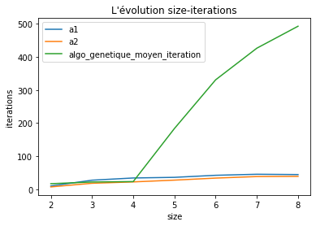
    


```python
n_range=[i for i in range(2,9)]
plt.plot(n_range,list_t1, label="a1")
plt.plot(n_range,list_t2, label="a2")
plt.plot(n_range,list_tt, label="algo_genetique_moyen_temp")
plt.legend()
plt.show()
```


    
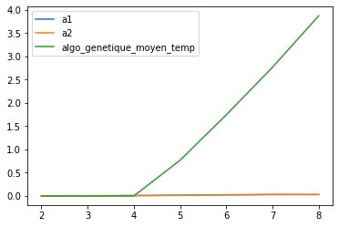
    


```python

```
